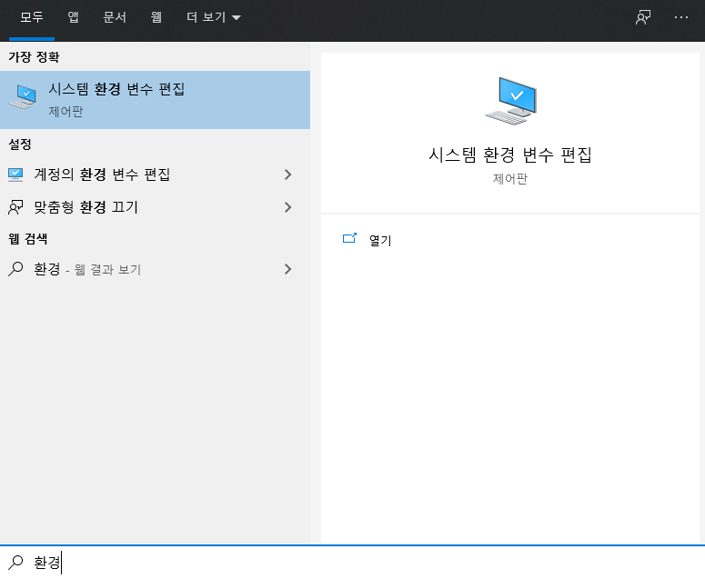
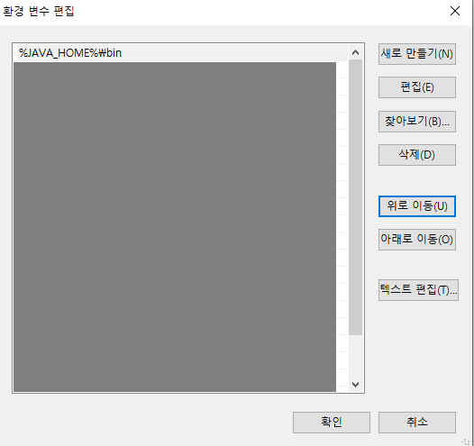

# JDK 11 Install

## 개요

자바 11 설치 및 환경 설정을 진행합니다.

## 자바 개발 도구(JDK) 설치

https://www.oracle.com/java/technologies/javase-jdk11-downloads.html 에서 운영체제에 맞는 버전을 다운받아 주세요.

주의) 
 - 다운로드 하려면 계정이 필요합니다. 없으시면 만들어주세요.
 - Java Se 11부터는 windows 32bit를 지원하지 않습니다.

### JAVA SE vs JAVA EE vs JAVA ME

[Java SE]

Standard Edition의 약자로 자바 라이브러리부터 API를 제공합니다.

[Java EE]

Enterprise Edition의 약자로 기업용으로 기업에서 사용하실 때 다운받습니다.

[Java Me]

Micro Edition의 약자로 임베디드를 위한 자바 플랫폼입니다.

### JDK / JRE

[JRE]

Java Runtime Environment(자바 실행 환경)입니다.

자바로 제작된 프로그램을 동작시키려면 JRE가 필요합니다.

Java Class Library가 포함되어있습니다.

[JDK]

Java Development Kit(자바 개발 키트)입니다.

javac, jheap, jconsole 등 다양한 기능이 포함되어있습니다.
 - javac : Java 컴파일
 - jheep : Java로 작성된 다양한 heep을 제공하는 무료 라이브러리
 - jconsole : JVM 모니터링을 위한 GUI툴

> 기존에는 JDK가 JRE를 포함 시키고 있었지만 JDK 11 부터는 포함 되어 있지 않습니다.<br>
jlink로 jre를 설치하기보단 개발 단계에서 어플리케이션에 링크를 걸어 실행환경을 번들로 포함시켜야 되는 것을 권장합니다.


### 자바 버전 표기법

```
Java SE {주 버전}.{개선 버전}.{업데이트 버전} {장기 지원 서비스 버전}
ex) Java SE 11.0.8 (LTS)
```

 - 주 버전 : 자바 언어에 많은 변화가 있을 경우 증가됩니다.(Major)
 - 개선 버전 : 0부터 시작하며 주 버전에서 일부 사항이 개선될 때 증가됩니다.(Minor)
 - 업데이트 버전 : 1~3개월 주기로 버그가 수정될 때마다 증가됩니다.(patch)
 - LTS : Long Term Support(장기 지원 서비스)를 받을 수 있는 버전입니다.

> Java 1.8 부터 Java 8로 부르기 시작했습니다. 즉, Java 1.8과 Java 8은 동일합니다.

### 설치 경로
Java SE 11 : C:\Program Files\Java\jdk-{버전}

Java SE 8  : C:\Program Files\Java\jdk{버전}


### 환경 변수 설정

자바를 설치했지만 실제로 개발 환경에서 사용하려면 환경 변수를 설정해 주어야합니다.



검색에서 "환경"이라고 검색하시면 <b>시스템 환경 변수 편집</b>이 출력됩니다.


<b>고급</b>탭에서 <b>환경 변수</b>버튼을 클릭해주세요.


시스템 변수의 <b>새로 만들기</b> 버튼을 클릭해주세요.


 - 변수 이름 : JAVA_HOME
 - 변수 값 : C:\Program Files\Java\jdk-11.0.8

입력해주세요.

시스템 변수에서 <b>Path</b>를 선택하고 편집 버튼을 클릭해주세요.



<b>새로 만들기</b>버튼 클릭 후 직접 <b>‘%JAVA_HOME%\bin’</b>을 입력후 <b>위로 이동</b>버튼을 클릭해 첫번째 항목으로 올려주세요.


<b>확인</b> 버튼을 클릭해 저장해주세요.

## 적용 확인

cmd를 실행시켜 `javac -version`을 입력했을 때

`java 11.0.8`이 출력되면 됩니다.


## 참고

https://post.naver.com/viewer/postView.nhn?volumeNo=22725606&memberNo=25379965

https://jhnyang.tistory.com/224

https://tinywolf.tistory.com/104

http://www.jheaps.org/
