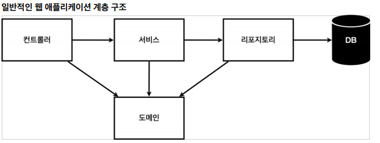
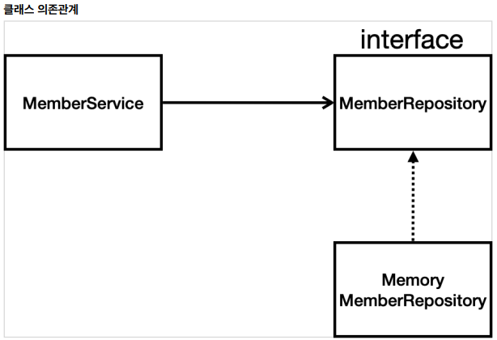
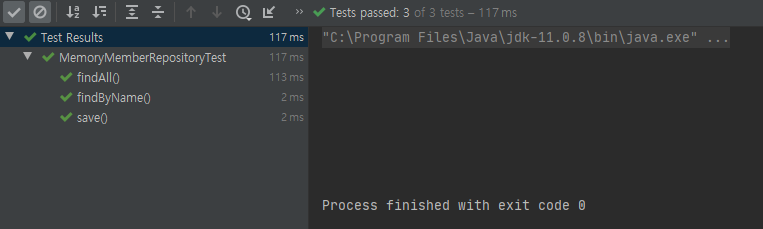
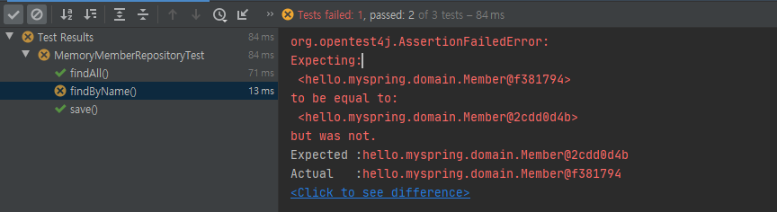

# 회원 관리 예제 - 백엔드

 - 비즈니스 요구사항 정리
 - 회원 도메인과 리포지토리 만들기
 - 회원 리포지토리 테스트 케이스 작성
 - 회원 서비스 개발
 - 회원 서비스 테스트

## 비즈니스 요구사항 정리

 - 데이터: 회원ID, 이름
 - 기능 : 회원 등록, 조회
 - DB는 아직 활용안합니다.



  - 컨트롤러 : 웹 MVC 역할
  - 서비스: 핵심 비즈니스 로직 구현
  - 리포지토리 : DB 접근
  - 도메인 : 비즈니스 도메인 객체



 - 아직 DB가 없기 때문에 MemberRepository을 메모리 구현체로 구현합니다.
 - 나중에 RBD, JPA로 변경하기 때문에 Interface로 설정합니다.


## 회원 도메인과 리포지토리 만들기

회원 객체

```java
package hello.myspring.domain;

public class Member {
    private Long id;
    private String name;

    public String getName() {
        return name;
    }

    public void setName(String name) {
        this.name = name;
    }

    public Long getId() {
        return id;
    }

    public void setId(Long id) {
        this.id = id;
    }
}
```

회원 리포지토리 인터페이스

```java
package hello.myspring.repository;

import hello.myspring.domain.Member;

import java.util.List;
import java.util.Optional;

public interface MemberRepository {
    Member save(Member member);
    Optional<Member> findById(Long id);
    Optional<Member> findByName(String name);
    List<Member> findAll();
}
```

회원 리포지토리 메모리 구현체

```java
package hello.myspring.repository;

import hello.myspring.domain.Member;

import java.util.*;

public class MemoryMemberRepository implements MemberRepository{

    private static Map<Long,Member> store = new HashMap<>();
    private static long sequence = 0L;

    @Override
    public Member save(Member member) {
        member.setId(++sequence);
        store.put(member.getId(), member);
        return member;
    }

    @Override
    public Optional<Member> findById(Long id) {
        return Optional.ofNullable(store.get(id));
    }

    @Override
    public Optional<Member> findByName(String name) {
        return store.values().stream().filter(member -> member.getName().equals(name)).findAny();
    }

    @Override
    public List<Member> findAll() {
        return new ArrayList<>(store.values());
    }

    public void clearStore(){
        store.clear();
    }
}
```

 - Optional
   - 반환값이 Null이 아니라 '없음'이라고 표시가 되도록하는 라이브러리입니다.
 - stream()
   - 람다를 활용할 수 있는 기술 중 하나입니다.
   - Java 8 버전에서 추가되었습니다.

## 회원 리포지토리 테스트 케이스 작성

구현한 기능들이 정상적으로 동작하는지 검증하는 과정입니다.

### 테스트 코드를 작성하는 이유

보통 단위 테스트를 사용하지 않고 테스트를 진행한다고 하면 main 메서드를 통해 실행하거나 컨트롤러를 통해 해당 기능을 실행합니다.

하지만, 이러한 방법은 준비 시간이 매우 오래걸리고 여러 테스트를 한번에 실행하기도 어렵습니다. 그리고 무엇보다 이런식으로 테스트를 진행하면 진행이 끝난 코드는 직접 지워줘야 됩니다. 나중에 어떤 테스트를 진행했는지 기억도 안나고 결과물도 따로 저장하지 않는 이상 관리가 어렵습니다.

이러한 문제점으로 자바에서는 JUnit이라는 프레임워크로 테스트를 실행하여 문제를 해결합니다.

### 테스트 코드 구현

```java
package hello.myspring.repository;

import hello.myspring.domain.Member;
import org.junit.jupiter.api.AfterEach;
import org.junit.jupiter.api.Test;

import java.util.List;

import static org.assertj.core.api.Assertions.assertThat;

class MemoryMemberRepositoryTest {
    MemoryMemberRepository repository = new MemoryMemberRepository();

    @AfterEach
    public void afterEach(){
        repository.clearStore();
    }

    @Test
    public void save(){
        Member member = new Member();
        member.setName("spring");

        repository.save(member);

        Member result = repository.findById(member.getId()).get();

        //System.out.println("result = " + (result == member));

        //Assertions.assertEquals(member, result);

        assertThat(member).isEqualTo(result);

    }

    @Test
    public void findByName(){
        Member member1 = new Member();
        member1.setName("spring1");
        repository.save(member1);

        Member member2 = new Member();
        member2.setName("spring2");
        repository.save(member2);


        Member result = repository.findByName("spring1").get();

        assertThat(result).isEqualTo(member1);
    }

    @Test
    public void findAll(){
        Member member1 = new Member();
        member1.setName("spring1");
        repository.save(member1);

        Member member2 = new Member();
        member2.setName("spring2");
        repository.save(member2);

        List<Member> result = repository.findAll();

        assertThat(result.size()).isEqualTo(2);
    }
}

```

@AfterEach : 콜백 어노테이션으로 테스트가 끝나면 자동으로 실행하는 함수입니다.

실무에서는 빌드하기전에 테스트를 돌려서 테스트에 실패한다면 다음단계로 안넘어가는 등의 안전장치로 사용합니다.

Optional의 데이터를 꺼내기위해서는 get()을 호출해야됩니다.
 - 실제 서비스하는 곳에서도 get()으로 데이터를 호출하면 안되고 테스트 코드에서는 사용해도 무방합니다.

주의) 테스트 코드는 작성한 코드 순서대로 작동이 되지도 않고 되어서도 안됩니다.

> shift + f6 rename하면 아래의 동일변수명을 동시에 치환합니다.



테스트 성공



테스트 실패

## Service 구현

```java
package hello.myspring.service;

import hello.myspring.domain.Member;
import hello.myspring.repository.MemberRepository;
import hello.myspring.repository.MemoryMemberRepository;

import java.util.List;
import java.util.Optional;

public class MemberService {
    private final MemberRepository memberRepository;

    public MemberService(MemberRepository memberRepository){
        this.memberRepository = memberRepository;
    }

    /**
    *회원가입
    */
    public Long join(Member member){
        validateDuplicateMember(member);//중복 회원 검증
        memberRepository.save(member);
        return member.getId();
    }

    private void validateDuplicateMember(Member member) {
        //같은 이름이 있는 중복 회원은 가입이 안됩니다.
        memberRepository.findByName(member.getName())
                .ifPresent(m -> {
                    throw new IllegalStateException("이미 존재하는 회원입니다.");
                });
    }

    /**
     *  전체 회원 조회
     * @return List<Member>
     */
    public List<Member> findMembers(){
        return memberRepository.findAll();
    }

    /**
     *  회원 아이디로 회원 검색
     * @return Optional<Member>
     */
    public Optional<Member> findOne(Long memberId){
        return memberRepository.findById(memberId);
    }

}
```

ifPresent(Consumer<? super T> consumer) : 특정 결과를 반환하는 대신 Optional 객체가 감싸고 있는 값이 존재할 경우에만 실행될 로직을 함수형 인자로 넘길 수 있습니다.

>ctrl + alt + v 변수 추출하기<br>
Ctrl + Alt + m 메소드 추출하기

## 회원 서비스 테스트 코드

> Ctrl + Shift + t 테스트 코드 껍데기 자동 생성

```java
package hello.myspring.service;

import hello.myspring.domain.Member;
import hello.myspring.repository.MemoryMemberRepository;
import org.assertj.core.api.Assertions;
import org.junit.jupiter.api.AfterEach;
import org.junit.jupiter.api.BeforeEach;
import org.junit.jupiter.api.Test;

import java.util.Optional;

import static org.assertj.core.api.Assertions.assertThat;
import static org.junit.jupiter.api.Assertions.*;

class MemberServiceTest {

    MemberService memberService;
    MemoryMemberRepository memoryMemberRepository;

    @BeforeEach
    public void beforeEach(){
        memoryMemberRepository = new MemoryMemberRepository();
        memberService = new MemberService(memoryMemberRepository);
    }

    @AfterEach
    void afterEach(){
        memoryMemberRepository.clearStore();
    }

    @Test
    void join() {
        //given
        Member member = new Member();
        member.setName("hello");

        //when
        Long saveId = memberService.join(member);

        //then
        Member findMember = memberService.findOne(saveId).get();
        assertThat(member.getName()).isEqualTo(findMember.getName());
    }

    @Test
    void 중복_회원_예외(){
        //given
        Member member1 = new Member();
        member1.setName("spring");

        Member member2 = new Member();
        member2.setName("spring");

        //when
        memberService.join(member1);

//        try {
//            memberService.join(member2);
//            fail();
//        } catch ( IllegalStateException e){
//            assertThat(e.getMessage()).isEqualTo("이미 존재하는 회원입니다.12321");
//        }

        IllegalStateException e = assertThrows(IllegalStateException.class, () -> memberService.join(member2));

        //then
        assertThat(e.getMessage()).isEqualTo("이미 존재하는 회원입니다.");

    }
}
```

 - Given-When-Then 패턴
   - 준비-실행-검증
   - Given(준비) : 사용할 데이터를 준비합니다.
   - When(실행) : 실제로 동작하는 테스트를 실행하는 과정입니다.
   - then(검증) : 결과값을 검증하는 과정입니다.

## 참고

https://www.inflearn.com/course/%EC%8A%A4%ED%94%84%EB%A7%81-%EC%9E%85%EB%AC%B8-%EC%8A%A4%ED%94%84%EB%A7%81%EB%B6%80%ED%8A%B8/lecture/49581?tab=note


