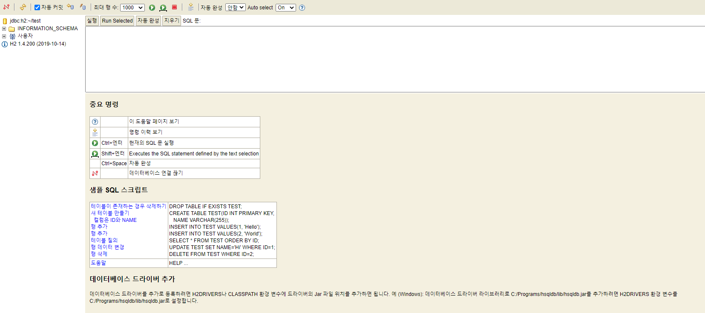
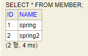
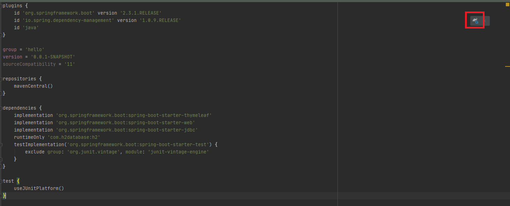
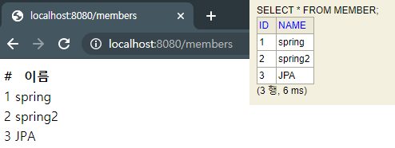
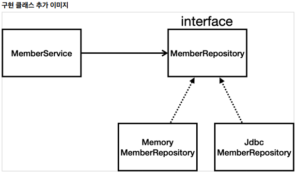
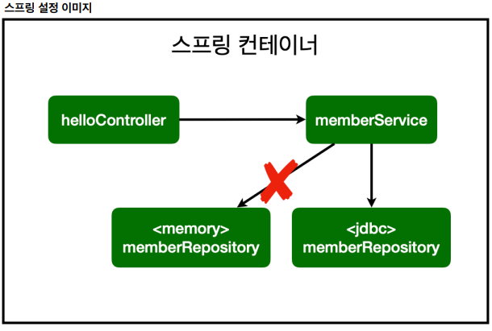
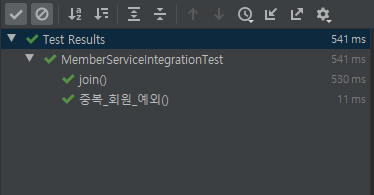

# 스프링 데이터 베이스 접근 기술

 - H2 데이터베이스 설치
 - 순수 Jdbc
 - 스프링 JdbcTemplate
 - JPA
 - 스프링 데이터 JPA

## H2 데이터베이스 설치

http://www.h2database.com/html/main.html

접속하여 설치파일을 다운로드 받아주세요.

`h2-setup-2019-10-14.exe`을 실행시켜 설치를 진행해주세요.

`H2 Console`을 실행시켜주세요.


교육용이니 별다른 설정은 하지않고 진행하겠습니다.

<b>연결</b>버튼을 클릭합니다.



접속 성공한 화면입니다.

JDBC URL을 보시면 `jdbc:h2:~/test`라고 설정이 되어있는데 현재는 파일로 접근을 하는 상태입니다.

이렇게 되면 어플리케이션과 콘솔이 동시에 한 파일로 접속을 하기 때문에 접속 오류가 생길 가능성이 있습니다.

`jdbc:h2:tcp://localhost/~/test`으로 수정합니다.

파일을 통해 접근하는 것이 아닌 소켓을 통해 접근합니다.

### 테이블 생성

```sql
drop table if exists member CASCADE;
create table member
(
 id bigint generated by default as identity,
 name varchar(255),
 primary key (id)
);
```

member 테이블을 생성합니다.
 - id pk 및 auto increment 설정
 - name varchar 255 설정


```sql
INSERT INTO MEMBER(name) VALUES ('spring');
INSERT INTO MEMBER(name) VALUES ('spring2');
```

초기 데이터를 세팅합니다.



결화 화면입니다.

### sql history

테이블을 수정하거나 생성하면 언제 누가 생성했는지 관리가 안될떄가 있습니다.

따로 프로그램을 써서 공유를 한다면 모르겠지만 그렇지 않는 경우에 DB가 바뀐것을 인지하지 못한 다른 작업자가 작업을 진행할 때 오류가 발생하고 해당 작업자는 엄청난 삽질을 시작합니다.

이러한 삽질을 방지하기 위해 간단한 파일을 하나 생성하여 history 추적을 합니다.

`\sql\sql_history.sql`

```sql
# MEMBER 테이블 생성
drop table if exists member CASCADE;
create table member
(
 id bigint generated by default as identity,
 name varchar(255),
 primary key (id)
);
```

이런식으로 변경 또는 생성된 테이블이 있다면 기록을 남기겠습니다.

이렇게 관리를 하면 git에 push를 넣을 때 마다 자동으로 같이 포함이 되어 올라가기 때문에 언제 누가 어떻게 테이블을 수정, 생성했는지 알 수 있습니다.

## 순수 Jdbc

현재는 순수 Jdbc를 이용한 개발을 많이 진행하지는 않습니다.

처음에는 이렇게 사용했다 정도로만 봐주세요.

`build.gradle`의 `dependencies`에 `jdbc`,`h2` 데이터베이스 관련 라이브러리를 추가합니다.

```gradle
dependencies {
	implementation 'org.springframework.boot:spring-boot-starter-thymeleaf'
	implementation 'org.springframework.boot:spring-boot-starter-web'
	implementation 'org.springframework.boot:spring-boot-starter-jdbc'
	runtimeOnly 'com.h2database:h2'
	testImplementation('org.springframework.boot:spring-boot-starter-test') {
		exclude group: 'org.junit.vintage', module: 'junit-vintage-engine'
	}
}
```

Java는 DB에 접속할 때 Jdbc 라이브러리가 필수입니다.

`com.h2database:h2` : 데이터베이스에 접속할 클라이언트입니다.



import 버튼을 클릭해 해당 패키지를 import해주세요.

### spring.properties 설정

`\src\main\resources\application.properties`

```properties
spring.datasource.url=jdbc:h2:tcp://localhost/~/test
spring.datasource.driver-class-name=org.h2.Driver
```

여기까지가 데이터베이스를 이용하기위한 준비입니다.

### 사용해보기

```java
package hello.myspring.repository;

import hello.myspring.domain.Member;

import org.springframework.jdbc.datasource.DataSourceUtils;
import javax.sql.DataSource;
import java.sql.*;
import java.util.ArrayList;
import java.util.List;
import java.util.Optional;

public class JdbcMemberRepository implements MemberRepository {
    private final DataSource dataSource;

    public JdbcMemberRepository(DataSource dataSource) {
        this.dataSource = dataSource;
    }

    @Override
    public Member save(Member member) {
        //sql 생성
        String sql = "insert into member(name) values(?)";

        Connection conn = null;
        PreparedStatement pstmt = null;
        ResultSet rs = null;

        try {
            conn = getConnection();
            pstmt = conn.prepareStatement(sql, Statement.RETURN_GENERATED_KEYS);
            pstmt.setString(1, member.getName()); // ?랑 매칭합니다.
            pstmt.executeUpdate(); // query 실행
            rs = pstmt.getGeneratedKeys(); // insert된 id값을 가져옵니다.Statement.RETURN_GENERATED_KEYS랑 매칭됩니다.
            if (rs.next()) {
                member.setId(rs.getLong(1));
            } else {
                throw new SQLException("id 조회 실패");
            }
            return member;
        } catch (Exception e) {
            throw new IllegalStateException(e);
        } finally {
            close(conn, pstmt, rs); // 소켓 파괴 (리소스 반환)
        }
    }

    @Override
    public Optional<Member> findById(Long id) {
        String sql = "select * from member where id = ?";

        Connection conn = null;
        PreparedStatement pstmt = null;
        ResultSet rs = null;

        try {
            conn = getConnection();
            pstmt = conn.prepareStatement(sql);
            pstmt.setLong(1, id);

            rs = pstmt.executeQuery();

            if(rs.next()) {
                Member member = new Member();
                member.setId(rs.getLong("id"));
                member.setName(rs.getString("name"));
                return Optional.of(member);
            } else {
                return Optional.empty();
            }
        } catch (Exception e) {
            throw new IllegalStateException(e);
        } finally {
            close(conn, pstmt, rs);
        }
    }

    @Override
    public List<Member> findAll() {

        String sql = "select * from member";

        Connection conn = null;
        PreparedStatement pstmt = null;
        ResultSet rs = null;

        try {
            conn = getConnection();
            pstmt = conn.prepareStatement(sql);

            rs = pstmt.executeQuery();

            List<Member> members = new ArrayList<>();
            while(rs.next()) {
                Member member = new Member();
                member.setId(rs.getLong("id"));
                member.setName(rs.getString("name"));
                members.add(member);
            }
            return members;
        } catch (Exception e) {
            throw new IllegalStateException(e);
        } finally {
            close(conn, pstmt, rs);
        }
    }

    @Override
    public Optional<Member> findByName(String name) {
        String sql = "select * from member where name = ?";

        Connection conn = null;
        PreparedStatement pstmt = null;
        ResultSet rs = null;

        try {
            conn = getConnection();
            pstmt = conn.prepareStatement(sql);
            pstmt.setString(1, name);

            rs = pstmt.executeQuery();

            if(rs.next()) {
                Member member = new Member();
                member.setId(rs.getLong("id"));
                member.setName(rs.getString("name"));
                return Optional.of(member);
            }
            return Optional.empty();
        } catch (Exception e) {
            throw new IllegalStateException(e);
        } finally {
            close(conn, pstmt, rs);
        }
    }

    private Connection getConnection() {
        return DataSourceUtils.getConnection(dataSource); //spring을 통해 connection을 얻습니다.
    }

    private void close(Connection conn, PreparedStatement pstmt, ResultSet rs)
    {
        try {
            if (rs != null) {
                rs.close();
            }
        } catch (SQLException e) {
            e.printStackTrace();
        }
        try {
            if (pstmt != null) {
                pstmt.close();
            }
        } catch (SQLException e) {
            e.printStackTrace();
        }
        try {
            if (conn != null) {
                close(conn);
            }
        } catch (SQLException e) {
            e.printStackTrace();
        }
    }

    private void close(Connection conn) throws SQLException {
        DataSourceUtils.releaseConnection(conn, dataSource); //spring을 통해 connection을 종료합니다.
    }
}
```

`SpringConfig`를 수정합니다.

```java
package hello.myspring;

import hello.myspring.repository.JdbcMemberRepository;
import hello.myspring.repository.MemberRepository;
import hello.myspring.service.MemberService;
import org.springframework.beans.factory.annotation.Autowired;
import org.springframework.context.annotation.Bean;
import org.springframework.context.annotation.Configuration;

import javax.sql.DataSource;

@Configuration
public class SpringConfig {

    private DataSource dataSource;

    @Autowired
    public SpringConfig(DataSource dataSource){
        this.dataSource = dataSource;
    }

    @Bean
    public MemberService memberService(){
        return new MemberService(memoryMemberRepository());
    }

    @Bean
    public MemberRepository memoryMemberRepository(){
        //return new MemoryMemberRepository();
        return new JdbcMemberRepository(this.dataSource);
    }
}
```



DB CR이 정상적으로 실행되는 모습을 확인하실수 있습니다.

이렇게 인터페이스의 구현체를 바꾸는 것만으로도 메모리에서 DB로 변경이 되었습니다.

이런 다형성 때문에 Spring을 사용하는 이유도 있습니다.





 - 개방 폐쇄 원칙(OCP, Open_Closed Principle)
   - 확장에는 열려있고 수정에는 닫혀있습니다.
 - 스프링의 DI를 사용하면 <b>기존 코드를 전혀 손대지 않고(web application), 설정만으로 구현 클래스를 변경</b>이 가능합니다.
 - 이제 DB에 저장하므로 서버 메모리와 다르게 서버를 내렸다가 다시 올려도 데이터가 남아있습니다.

### 스프링 통합 테스트

DB를 연결했으니 DB작동까지 테스트를 진행합니다.

이전에 테스트했던 코드는 순수하게 Java코드만 이용해서 테스트를 진행했습니다.

하지만 DB가 붙은 이후에 테스트를 진행하려면 DB connection 등의 추가 패키지가 필요합니다.

> 테스트를 진행할 때는 모두 구현이 된 상태에서 진행하기 때문에 필드 autowired를 받아도 무방합니다.

Test Code

```java
package hello.myspring.service;

import hello.myspring.domain.Member;
import hello.myspring.repository.MemberRepository;
import org.junit.jupiter.api.Test;
import org.springframework.beans.factory.annotation.Autowired;
import org.springframework.boot.test.context.SpringBootTest;
import org.springframework.transaction.annotation.Transactional;

import static org.assertj.core.api.Assertions.assertThat;
import static org.junit.jupiter.api.Assertions.assertThrows;

@SpringBootTest
@Transactional
class MemberServiceIntegrationTest {

    @Autowired MemberService memberService;
    @Autowired MemberRepository memoryMemberRepository;

    @Test
    void join() {
        //given
        Member member = new Member();
        member.setName("hello");

        //when
        Long saveId = memberService.join(member);

        //then
        Member findMember = memberService.findOne(saveId).get();
        assertThat(member.getName()).isEqualTo(findMember.getName());
    }

    @Test
    void 중복_회원_예외(){
        //given
        Member member1 = new Member();
        member1.setName("springTest1");

        Member member2 = new Member();
        member2.setName("springTest2");

        //when
        memberService.join(member1);

        IllegalStateException e = assertThrows(IllegalStateException.class, () -> memberService.join(member2));

        assertThat(e.getMessage()).isEqualTo("이미 존재하는 회원입니다.");

    }
}
```
 - @spring : 스프링 컨테이너와 테스트를 함께 실행합니다.
 - @Transactional : DB commit 전에 롤백합니다.
   - DB에 반영을 하지 않습니다.
   - test에만 commit을 하지않고 @service 등 이런 어노테이션에 붙으면 commit을 진행합니다.

> 기존에 있던 테스트 코드는 단위 테스트, DB까지 연결해서 테스트하는 것을 통합테스트라고 합니다.

> 모든 테스트는 단위 테스트로도 실행이 가능하도록 설계하는 것이 좋습니다.



## 스프링 JdbcTemplate

## JPA

## 스프링 데이터 JPA


## 참고

https://www.inflearn.com/course/%EC%8A%A4%ED%94%84%EB%A7%81-%EC%9E%85%EB%AC%B8-%EC%8A%A4%ED%94%84%EB%A7%81%EB%B6%80%ED%8A%B8/lecture/49593?tab=curriculum

https://www.inflearn.com/course/%EC%8A%A4%ED%94%84%EB%A7%81-%EC%9E%85%EB%AC%B8-%EC%8A%A4%ED%94%84%EB%A7%81%EB%B6%80%ED%8A%B8/lecture/49594?tab=curriculum

https://www.inflearn.com/course/%EC%8A%A4%ED%94%84%EB%A7%81-%EC%9E%85%EB%AC%B8-%EC%8A%A4%ED%94%84%EB%A7%81%EB%B6%80%ED%8A%B8/lecture/49595?tab=curriculum
