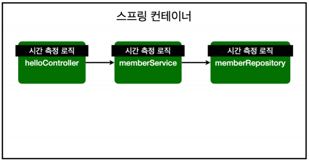
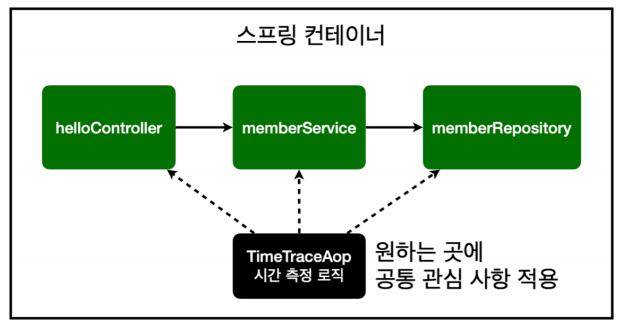
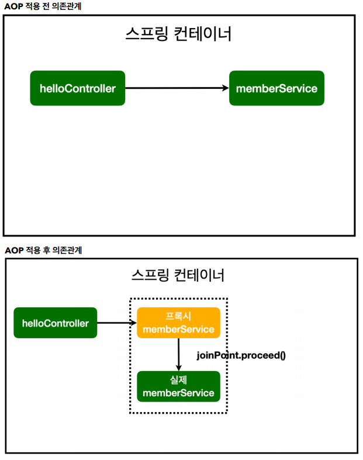
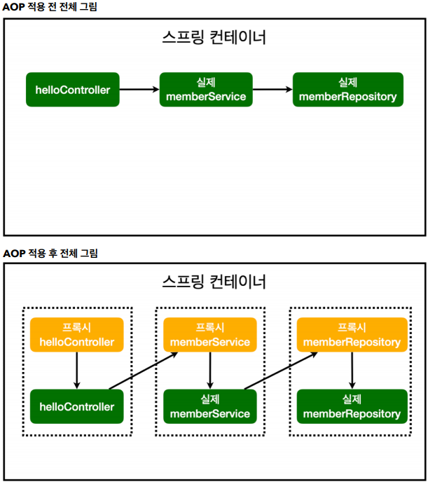

# AOP

## AOP가 필요한 상황

 - 모든 메소드의 호출 시간을 측정하고 싶다면?
 - 공통 관심 사항(croos-cutting concern) vs 핵심 관심 사항(core concern)
 - 회원 가입 시간, 회원 조회 시간을 측정하고 싶다면?

 

 MemberService 회원 조회 시간 측정

 ```java
 public Long join(Member member) {
    long start = System.currentTimeMillis();

    try {
        validateDuplicateMember(member); //중복 회원 검증
        memberRepository.save(member);
        return member.getId();
    } finally {
        long finish = System.currentTimeMillis();
        long timeMs = finish - start;
        System.out.println("join " + timeMs + "ms");
    }
 }
 ```

 이런식으로 진행할 경우 사용하는 메소드별로 전부 직접 코드를 적어주어야합니다.

 프로젝트가 적으면 괜찮지만 만약 메소드가 수백개라면 물리적으로 불가능합니다.

 인수인계를 제대로 하는 경우에는 그나마 히스토리가 남지만 만약 제대로 인수인계를 못하는 경우 다음 작업자가 코드를 본경우 유지보수가 매우 어렵습니다.

## AOP 적용

 - AOP : Aspect Oriented Programming
 - 공통 관심 사항(croos-cutting concern), 핵심 관심 사항(core concern) 분리

 

 원하는 메소드에 직접 로직을 수정하는 것이 아닌 적용을 하는 방식입니다.

```java
package hello.myspring.aop;

import org.aspectj.lang.ProceedingJoinPoint;
import org.aspectj.lang.annotation.Around;
import org.aspectj.lang.annotation.Aspect;
import org.springframework.stereotype.Component;

@Aspect
@Component
public class TimeTraceAop {

    @Around("execution(* hello.myspring..*(..))")
    public Object execut(ProceedingJoinPoint joinPoint) throws Throwable{

        long start = System.currentTimeMillis();

        System.out.println("Start = "+joinPoint.toString());
        try{
            return joinPoint.proceed();
        } finally {
            long finish = System.currentTimeMillis();
            long timeMs = finish - start;
            System.out.println("End = "+joinPoint.toString()+" "+timeMs);
        }

    }

}
```
시간을 측정하는 로직을 별도의 공통 로직으로 제작가능합니다.

핵심 관심 사항을 깔끔하게 유지할 수 있습니다.

`@Around` : 적용 범위 입니다. 
 - hello 패키지의 myspring 패키지의 모든 메소드를 적용합니다.

중간에 메소드 호출마다 Intercept하여 작동합니다.

```log
Start = execution(String hello.myspring.controller.MemberController.list(Model))
Start = execution(List hello.myspring.service.MemberService.findMembers())
Start = execution(List org.springframework.data.jpa.repository.JpaRepository.findAll())
Hibernate: select member0_.id as id1_0_, member0_.name as name2_0_ from member member0_
End = execution(List org.springframework.data.jpa.repository.JpaRepository.findAll()) 125
End = execution(List hello.myspring.service.MemberService.findMembers()) 129
End = execution(String hello.myspring.controller.MemberController.list(Model)) 146
 ```



컨테이너가 올라갈 때 가짜 스프링 빈이 올라오며 이를 `프록시`라고합니다.

가짜 스프링 빈의 로직이 끝나면 진짜 스프링 빈의 로직이 실행됩니다.



## 참고

https://www.inflearn.com/course/%EC%8A%A4%ED%94%84%EB%A7%81-%EC%9E%85%EB%AC%B8-%EC%8A%A4%ED%94%84%EB%A7%81%EB%B6%80%ED%8A%B8/lecture/49601?tab=curriculum