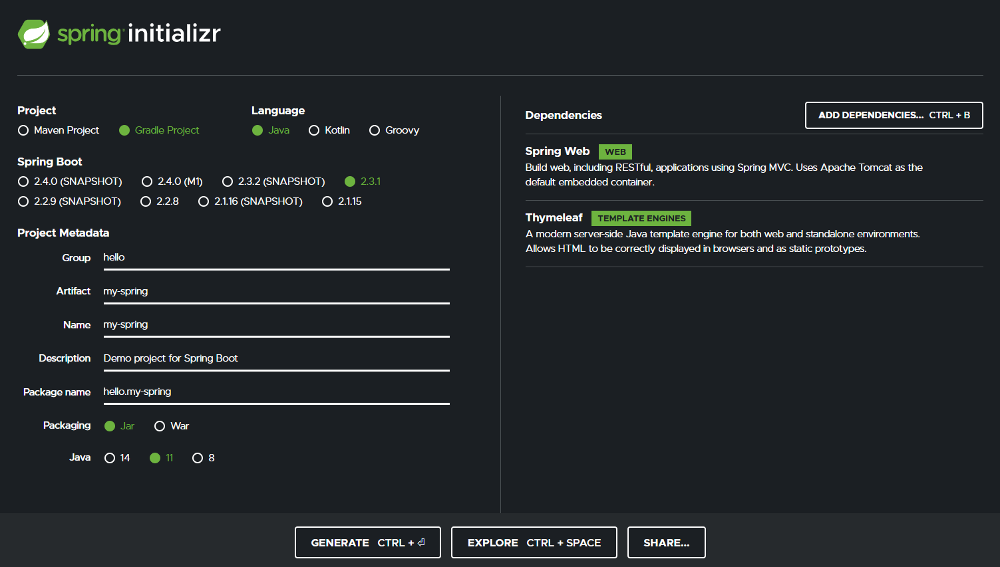
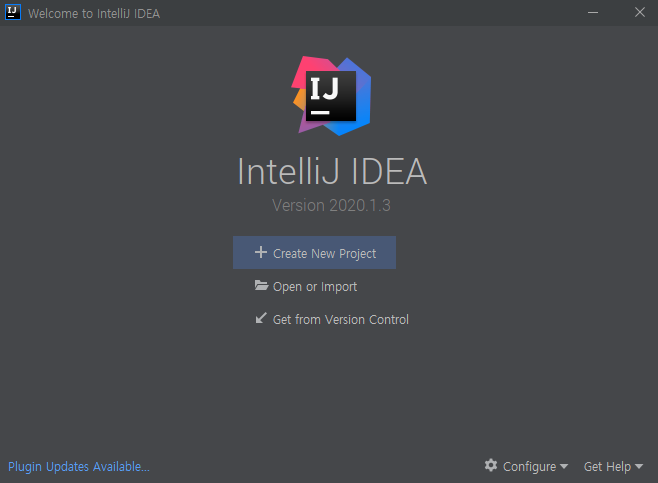
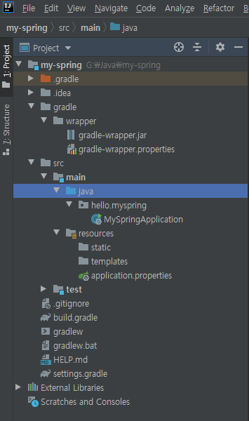
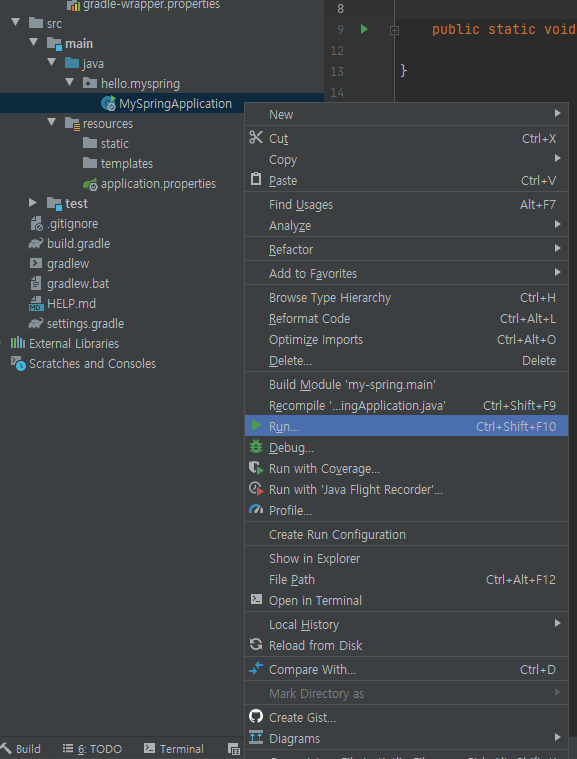
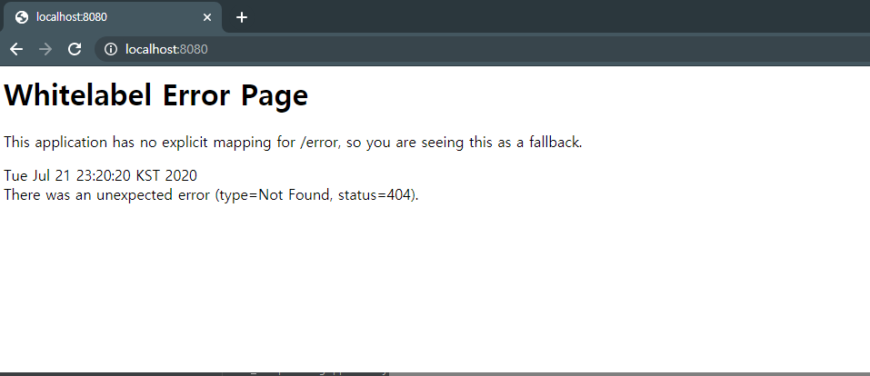
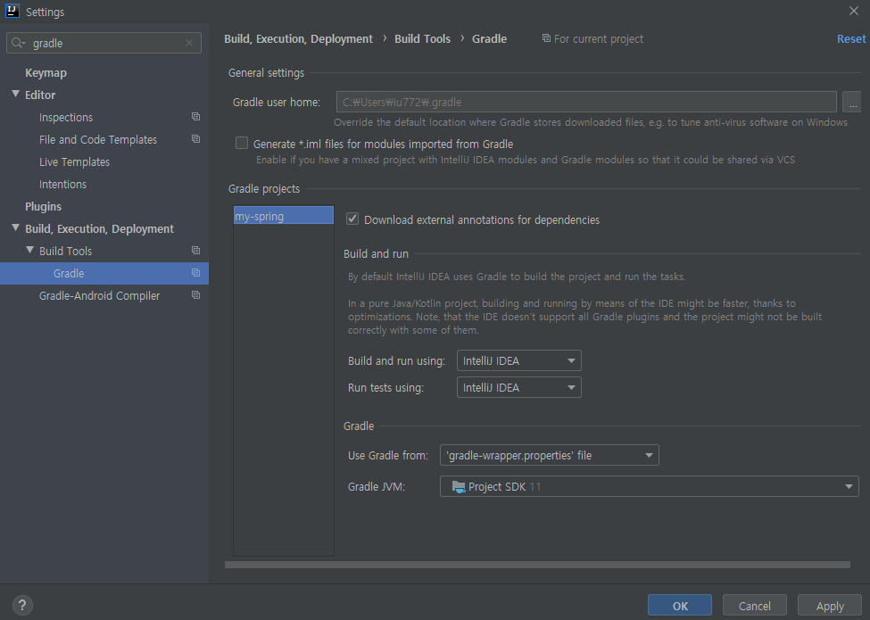

# Project 생성

## 개발 환경
 - Java 11
 - IntelliJ

## 기본 생성

https://start.spring.io 로 접속하여 프로젝트 생성합니다.

### Project
많이 사용하는 Gradle Project를 선택합니다.

### Language
Java를 사용하기 때문에 Java를 선택합니다.

### Spring Boot
버전을 선택할 떄 SNAPSHOT, M1같은 버전은 제작 중이거나 정식 지원버전이 아닙니다.
따라서 안정된 버전 중 가장 높은 2.3.1을 선택하겠습니다.

### Project Metadata
 - Group : 기업명
 - Artifact : 프로젝트 명
 - Java : 버전 선택

### Dependencies
의존성 라이브러리를 설정합니다.
 - Spring Web : 웹 프로젝트
 - Thymeleaf : template ngin

Generate 버튼 클릭하면 zip파일을 다운로드 받고 압축을 풀어주세요.

Open Or Import를 클릭 후 압축 해제한 폴더에서 <b>build.gradle</b> 파일을 클릭하면 팝업이 하나 나오는데 <b>Open as Project</b>를 클릭합니다.

프로젝트가 열리고 외부에서 라이브러리를 다운로드합니다.
> 네트워크 연결이 되어있어야됩니다.

### 파일 구조

 - gradle : gradle 관련 폴더입니다.   
 - test : 테스트 코드를 작성하는 공간입니다.
 - resources : html등 자바 소스 코드를 제외한 파일을 보관합니다.
 - build.gradle : gradle 설정파일입니다.
   - 버전 설정, 의존성 라이브러리 설정

## 실행

실행 결과

### 실행이 제대로 안될 떄
가끔 Java를 실행하는게 아니라 gradle을 통해 실행할 때가 있는데 그럴때는 `ctrl+alt+s`를 눌러 setting 팝업을 띄워줍니다.

`gradle`검색 후 `Build and Run using / Run tests using`을 `IntelliJ IDEA`로 변경해주세요.

이렇게 설정하시면 IntelliJ에서 바로 자바를 띄워서 속도가 빠릅니다.

# 참고

https://www.inflearn.com/course/%EC%8A%A4%ED%94%84%EB%A7%81-%EC%9E%85%EB%AC%B8-%EC%8A%A4%ED%94%84%EB%A7%81%EB%B6%80%ED%8A%B8/dashboard