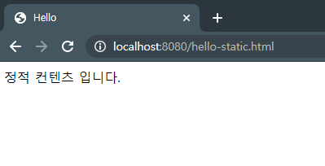
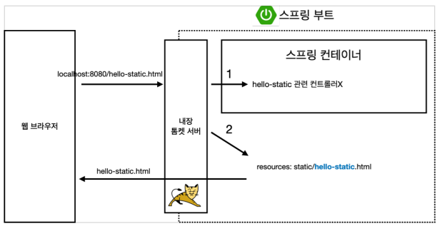
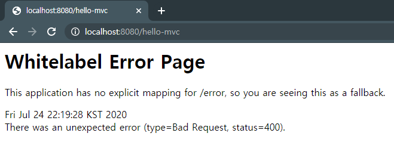
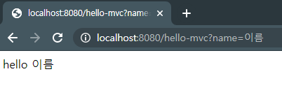
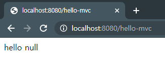
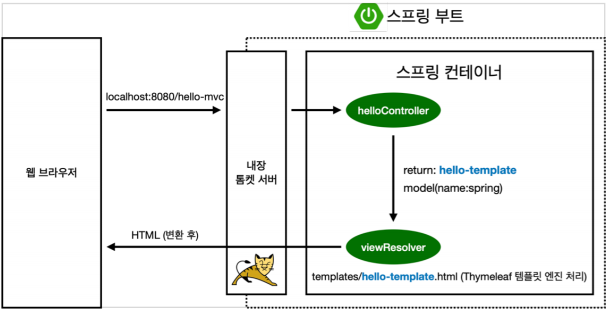
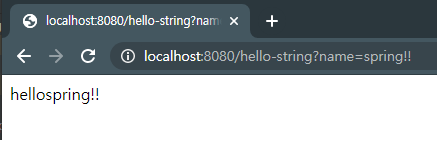
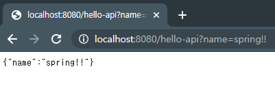
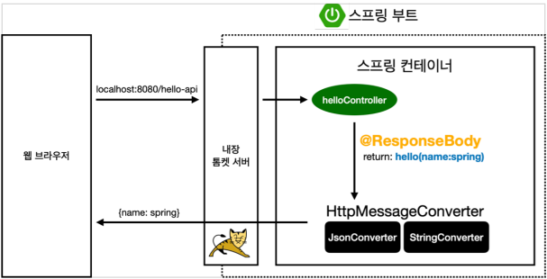

# Spring 기초

## 목차
 - 정적 컨텐츠
 - MVC와 템플릿 엔진
 - API


### 정적 컨텐츠
 - 파일을 그대로 웹브라우저에 전달해주는 방식입니다.

`resources/static/hello-static.html`

```html
<!DOCTYPE HTML>
<html>
<head>
    <title>Hello</title>
    <meta http-equiv="Content-Type" content="text/html; charset=UTF-8" />
</head>
<body>
정적 컨텐츠 입니다.
</body>
</html>
```



파일의 내용을 그대로 표시합니다.



간단하게 표시한 구조입니다.

1. Spring Controller에 먼저 hello-static을 찾습니다.
2. Controller에 없을 경우 resources의 static 폴더에서 찾습니다.

> https://docs.spring.io/spring-boot/docs/2.3.1.RELEASE/reference/html/spring-boot-features.html#boot-features-spring-mvc-static-content

### MVC
 - 서버에서 데이터를 받아 변경하여 웹브라우저에 전달해주는 방식입니다.
 - Model, View, Controller
   - Controller : 데이터 가공이나 비즈니스 모델이 담긴 파일입니다.
   - Model : Controller에서 가공된 데이터를 담는 역할을 합니다.
   - View : Controller가 Model을 사용하여 넘겨준 데이터를 기반으로 화면을 그립니다.

Controller
```java
@GetMapping("hello-mvc")
public String helloMvc(@RequestParam("name") String name, Model model){
    model.addAttribute("name",name);
    return "hello-template";
}
```

View
```html
<html xmlns:th="http://www.thymeleaf.org">
    <body>
        <p th:text="'hello ' + ${name}">hello! empty</p>
    </body>
</html>
```



`localhost:8080/hello-mvc`로 접속하면 나오는 화면입니다.

`2020-07-24 22:19:28.022  WARN 31172 --- [nio-8080-exec-5] .w.s.m.s.DefaultHandlerExceptionResolver : Resolved [org.springframework.web.bind.MissingServletRequestParameterException: Required String parameter 'name' is not present]`

서버에 에러 로그를 보니 `Required String parameter 'name' is not present`라는 문구가 있습니다.

필수 파라미터인 name이 없어서 에러가 발생했다는 뜻입니다.



다시 Get방식으로 데이터를 넘겨주니 정상적으로 페이지가 출력됩니다.

```java
@GetMapping("hello-mvc")
public String helloMvc(@RequestParam(value = "name", required = false) String name, Model model){
    model.addAttribute("name",name);
    return "hello-template";
}
```

만약 해당 파라미터를 필수로 넘기고 싶지 않다면 위 코드와 같이 required를 false로 설정해주시면 됩니다. 
> required의 default값은 true입니다.



파라미터를 넘기지 않았으나 정상적으로 페이지가 출력되는 것을 확인하실 수 있습니다.



MVC의 간단한 동작 플로우입니다.

 1. 웹브라우저에서 url호출합니다.
 2. Controller에서 맵핑된 url이 있기때문에 설정된 동작을 진행합니다.
 3. viewResolver는 Thymeleaf 템플릿 엔진을 호출합니다.
 4. Thyemleaf는 HTML을 변환 후 반환합니다.

### API
 - Json 형식으로 데이터를 전달해주는 방식입니다.
 - 서버끼리 통신할때 사용합니다.

 ```java
@GetMapping("hello-string")
@ResponseBody
public String helloString(@RequestParam("name") String name){
    return "hello" + name;
}
 ```



return한 값 그대로 출력되는 모습을 확인할 수 있습니다.

`controller`

```java
 @GetMapping("hello-api")
@ResponseBody
public Hello helloApi(@RequestParam("name") String name){

    Hello hello = new Hello();

    hello.setName(name);

    return hello;

}
```

`Model`

```java
package hello.myspring.model;

public class Hello {
    private String name;

    public String getName() {
        return name;
    }

    public void setName(String name) {
        this.name = name;
    }
}

```

> ctrl + shift + enter 닫히지 않은 괄호 및 세미콜론을 전부 입력해줍니다.(IntelliJ)
<br>
import되지 않은 패키지가 있다면 alt + enter를 입력하시면 자동으로 패키지가 import됩니다.<br>



json형식으로 출력되는 모습을 확인할 수 있습니다.




간단한 동작 플로우입니다.


## 참고

https://www.inflearn.com/course/%EC%8A%A4%ED%94%84%EB%A7%81-%EC%9E%85%EB%AC%B8-%EC%8A%A4%ED%94%84%EB%A7%81%EB%B6%80%ED%8A%B8/lecture/49578?tab=curriculum

 1. route된 controller를 따라갑니다.
 2. @ResponseBody어노테이션이 붙은걸 확인한 Controller가 문자 또는 객체를 반환합니다.  
  2.1 문자 -> StringConverter / 객체 -> JsonConverter가 사용됩니다. 

- @ResponseBody : '데이터 그대로 출력한다'라는 어노테이션입니다.
   - 템플릿 엔진을 사용하지않고 String이 그대로 전달되고 출력됩니다.
   - html태그도 출력이 되지않습니다.
   - Default return값은 Json입니다.