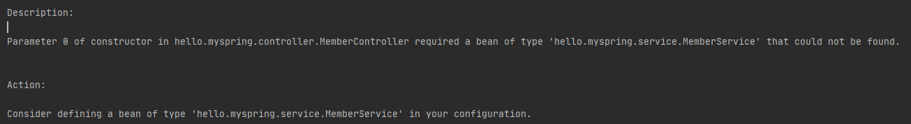
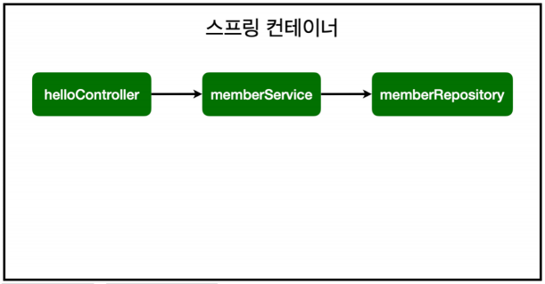

# 스프링 빈과 의존관계

 - 컴포넌트 스캔과 자동 의존관계 설정
 - 자바 코드로 직접 스프링 빈 등록하기

## 컴포넌트 스캔과 자동 의존관계 설정

`@Component` 어노테이션이 등록된 Class는 스프링 컨테이너에서 관리가 됩니다.

 - @Component를 포함하는 어노테이션도 스프링 빈으로 자동으로 등록됩니다.
   - @Controller
   - @Service
   - @Repository
 - 자동으로 등록시켜주는 범위는 main Class가 있는 패키지와 하위 패키지만 등록됩니다.

이렇게 스프링이 등록한 빈은 `싱글톤(Singleton)`으로 관리됩니다.

```java
package hello.myspring.controller;

import hello.myspring.service.MemberService;
import org.springframework.beans.factory.annotation.Autowired;
import org.springframework.stereotype.Controller;

@Controller
public class MemberController {

    private  final MemberService memberService;

    @Autowired
    public MemberController(MemberService memberService) {
        this.memberService = memberService;
    }
}

```

의존성 주입으로 MemberService를 주입받습니다.
 
만약 저와 같은 예제로 작성한 상태로 실행시키면 오류가 출력됩니다.



`'hello.myspring.service.MemberService' that could not be found.`라는 에러를 확인하실 수 있습니다.

그 이유는 `MemberService`는 현재 순수한 자바 class파일입니다. Spring Container가 관리를 하고 있지 않는 상태라는 거죠. Spring Container의 관리를 받으려면 어노테이션을 추가해야 됩니다.

```java
package hello.myspring.service;

~

@Service
public class MemberService {
    ...
}

package hello.myspring.repository;

~

@Repository
public class MemoryMemberRepository implements MemberRepository{
    ...
}
```
이렇게 어노테이션을 등록을 시켜줘야 의존성 주입이 가능합니다.

Repository도 등록을 시켜줘야 의존성 주입이 가능합니다.



어노테이션으로 등록된 현재 Spring Container의 구조입니다.

## 자바 코드로 직접 스프링 빈 등록하기

정해져있는 어노테이션이 아닌 하나하나 직접 스프링에 등록하는 방법입니다.

```java
package hello.myspring;

import hello.myspring.repository.MemoryMemberRepository;
import hello.myspring.service.MemberService;
import org.springframework.context.annotation.Bean;
import org.springframework.context.annotation.Configuration;

@Configuration
public class SpringConfig {

    @Bean
    public MemberService memberService(){
        return new MemberService(memoryMemberRepository());
    }

    @Bean
    public MemoryMemberRepository memoryMemberRepository(){
        return new MemoryMemberRepository();
    }
}
```

## 의존성 주입 (Dependency Injection : DI)

XML로 설정하는 방식도 있지만 최근에는 잘 사용하지 않습니다.

DI는 생성자, setter, 필드 주입으로 3가지 방법이 있습니다.

### 필드
`@Autowired private final MemberService memberService;`이런식으로 사용이 가능하지만 원하는 내용으로 커스텀이 불가능합니다.

### setter

```java
@Autowired
public void setMemberService(MemberService memberService){
    return this.memberService = memberService;
}
```

필수로 DI되어야하는 클래스가 DI되지 않아 오류가 발생할 수도 있습니다.

의존관계가 실행중에 동적으로 변하는 경우는 없으므로 생성자 주입을 권장합니다.

### 생성자

```java
@Autowired
public void MemberService(MemberService memberService){
    return this.memberService = memberService;
}
```

정형화된 코드는 컴포넌트 스캔을 이용합니다.

<b>상황에 따른 구현 클래스를 변경</b>해야 하면 설정을 통해 스프링 빈으로 등록합니다.

## 참고

https://www.inflearn.com/course/%EC%8A%A4%ED%94%84%EB%A7%81-%EC%9E%85%EB%AC%B8-%EC%8A%A4%ED%94%84%EB%A7%81%EB%B6%80%ED%8A%B8/lecture/49586?tab=curriculum

