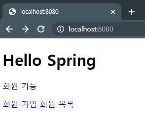
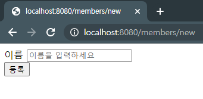
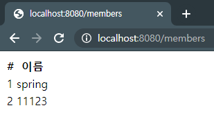

# 회원 관리 예제 - 웹 MVC 

 - 회원 웹 기능
   - 홈 화면 추가
   - 등록
   - 조회


## 홈 화면 추가

Controller

```java
package hello.myspring.controller;

import org.springframework.stereotype.Controller;
import org.springframework.web.bind.annotation.GetMapping;

@Controller
public class HomeController {

    @GetMapping("/")
    public String home(){
        return "home";
    }

}
```

View

```html
<!DOCTYPE HTML>
<html xmlns:th="http://www.thymeleaf.org">
    <body>
        <div class="container">
            <div>
                <h1>Hello Spring</h1>
                <p>회원 기능</p>
                <p>
                    <a href="/members/new">회원 가입</a>
                    <a href="/members">회원 목록</a>
                </p>
            </div>
        </div> <!-- /container -->
    </body>
</html>
```

`localhost:8080`



> static/index.html을 먼저 출력하지 않는 이유는 스프링 컨테이너는 컨트롤러의 맵핑된 라우트를 먼저 실행합니다.


## 회원 등록

### Get

Controller

```java
package hello.myspring.controller;

~

@GetMapping("/members/new")
public String createFrom(){
    return "members/createMemberForm";
}
```

View

`\src\main\resources\templates\members\createMemberForm.html`

```html
<!DOCTYPE HTML>
<html xmlns:th="http://www.thymeleaf.org">
<body>
<div class="container">
    <form action="/members/new" method="post">
        <div class="form-group">
            <label for="name">이름</label>
            <input type="text" id="name" name="name" placeholder="이름을 입력하세요">
        </div>
        <button type="submit">등록</button>
    </form>
</div> <!-- /container -->
</body>
</html>
```




### Post


```java
@PostMapping("/members/new")
public String create(MemberForm memberForm){
    Member member = new Member();
    member.setName(memberForm.getName());

    memberService.join(member);

    return "redirect:/";
}
```

```java
package hello.myspring.controller;

public class MemberForm {

    private String name;

    public String getName() {
        return name;
    }

    public void setName(String name) {
        this.name = name;
    }
}
```

Form태그의 Methods가 Post로 설정이 되어있으므로 PostMapping으로 받아서 저장합니다.

## 조회

Controller

```java
@GetMapping("/members")
public String list(Model model){
    List<Member> members = memberService.findMembers();
    model.addAttribute("members",members);

    return "members/memberList";
}
```

View

```html
<!DOCTYPE HTML>
<html xmlns:th="http://www.thymeleaf.org">
<body>
<div class="container">
    <div>
        <table>
            <thead>
            <tr>
                <th>#</th>
                <th>이름</th>
            </tr>
            </thead>
            <tbody>
            <tr th:each="member : ${members}">
                <td th:text="${member.id}"></td>
                <td th:text="${member.name}"></td>
            </tr>
            </tbody>
        </table>
    </div>
</div> <!-- /container -->
</body>
</html>
```

