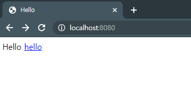
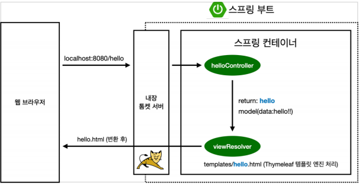

# 간단 페이지 만들기

## Welcome Page 만들기

`resources/static/index.html`

```html
<!DOCTYPE HTML>
<html>
<head>
    <title>Hello</title>
    <meta http-equiv="Content-Type" content="text/html; charset=UTF-8" />
</head>
<body>
Hello
<a href="/hello">hello</a>
</body>
</html>
```

작성 후 실행화면



Spring에 내장되어 있는 라이브러리가 동작하여 Html로 연결시켰습니다. 

이러한 것을 정리해놓은 공식 문서가 있습니다.

https://docs.spring.io/spring-boot/docs/2.3.1.RELEASE/reference/html/

개발을 진행하다 막히는 부분이 있다면 가장 먼저 찾아보면됩니다.

## thymeleaf 템플릿 엔진

공식사이트 : https://www.thymeleaf.org/
 - 3.x부터 성능 개선이 많이되어 쓸만해졌습니다.


## 동적으로 동작하는 페이지 만들기

### Controller

`src/main/java/hello/myspring/controller`
```java
package hello.myspring.controller;

import org.springframework.stereotype.Controller;
import org.springframework.ui.Model;
import org.springframework.web.bind.annotation.GetMapping;

@Controller
public class HelloController {

    @GetMapping("hello")
    public String hello(Model model){
        model.addAttribute("data","hello!!");
        return "hello";
    }
}
```
 - Model에 data에 "hello!!"을 저장합니다.
> `return "hello";`의 hello를 ctrl+클릭하면 해당 템플릿으로 이동합니다.


### Html

`src/main/resources/templates`
```html
<!DOCTYPE HTML>
<html xmlns:th="http://www.thymeleaf.org">
<head>
    <title>Hello</title>
    <meta http-equiv="Content-Type" content="text/html; charset=UTF-8" />
</head>
<body>
<p th:text="'안녕하세요' + ${data}">안녕하세요. 손님</p>
</body>
</html>
```

 - `<html xmlns:th="http://www.thymeleaf.org">`
   - html tag에 thymeleaf 선언합니다.
 - `<p th:text="'안녕하세요' + ${data}">안녕하세요. 손님</p>`
   - thymeleaf의 문법이 사용가능합니다.
   - Model에서 선언한 data를 가져옵니다.

### 동작 구조



 - Controller에서 return 값으로 문자를 반환 시 `viewResolver`가 템플릿을 찾아서 호출합니다.
   - Spring Boot 템플릿엔진은 기본으로 viewName과 매핑됩니다.
   - `resources/templates/{viewName}`

> `spring-boot-devtools` 라이브러리 추가시 html을 컴파일만 해주면 서버 재시작 없이 View파일 변경이 가능하다.(Hot Reloading)

## Build

`./gradlew build` cmd OR bash에 명령어를 입력합니다.

> windows는 ./gradlew.bat 입니다.

`cd /build/libs/` 으로 이동합니다.

`java -jar my-spring-0.0.1-SNAPSHOT.jar ` 

jar파일을 실행시키면 Spring이 실행됩니다.

## 참고
https://www.inflearn.com/course/%EC%8A%A4%ED%94%84%EB%A7%81-%EC%9E%85%EB%AC%B8-%EC%8A%A4%ED%94%84%EB%A7%81%EB%B6%80%ED%8A%B8/dashboard