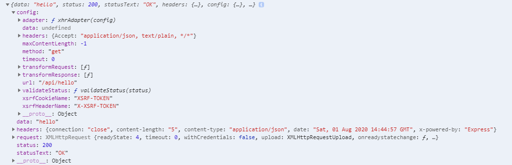

# Spring Boot 와 Vue 연동

## 개요

Spring Boot 와 Vue 연동을 진행하여 Back-end와 Front-end를 구분합니다.

Java install, Spring Boot Project Setting, npm install, vue.js install은 따로 설명하지 않습니다.

## Spring Boot

https://start.spring.io/ 에서 필요한 설정을 진행하여 초기 프로젝트를 설정합니다.

## vue 

프로젝트의 src폴더로 이동 후 `vue create frontend`를 입력합니다.

저는 default로 생성했습니다.


vue project가 생성된 모습을 확인할 수 있습니다.


## proxy 설정


 - localhost:8080으로 요청을 진행합니다.
 - 특정 Url를 지정하고 해당 url의 요청이 온경우 localhost:3000으로 요청을 보냅니다.


 

 

VM options에 `-Dserver.port=3000`을 입력합니다.


```js
module.exports = {
    devServer: {
        proxy: {
            '/api' : {
                target: "http://localhost:3000",
                ws:true,
                changeOrigin: true
            },
        }
    }
}
```

`src/frontend/`에 `vue.config.js`을 생성합니다.

위의 내용을 작성하여 proxy설정을 진행합니다.

localhost:8080/api로 오는 요청은 localhost:3000/api로 다시 요청합니다.

```java
package mh.todo.controller;

import org.springframework.web.bind.annotation.GetMapping;
import org.springframework.web.bind.annotation.RestController;

@RestController
public class HelloController {

    @GetMapping("/api/hello")
    public String hello(){
        return "hello";
    }

}
```

간단한 Controller 하나만 생성합니다.

```js
<template>
  <div id="app">
    
    <HelloWorld msg="Welcome to Your Vue.js App"/>
  </div>
</template>

<script>
import HelloWorld from './components/HelloWorld.vue'
import request from "request"

export default {
  name: 'App',
  components: {
    HelloWorld
  },
  mounted() {
    request('http://localhost:8080/api/hello' ,function (error, response, body) {
      console.log("error", error);
      console.log("response",response);
      console.log("body",body);
    })
  }
}
</script>

<style>
#app {
  font-family: Avenir, Helvetica, Arial, sans-serif;
  -webkit-font-smoothing: antialiased;
  -moz-osx-font-smoothing: grayscale;
  text-align: center;
  color: #2c3e50;
  margin-top: 60px;
}
</style>
```

`App.vue`에 아까 만들어둔 컨트롤러에 요청을 합니다.

> localhost:8080입니다.

터미널창에서 `src/frontend`로 이동하여 `npm run serve`을 입력하여 vue서버를 실행합니다.

Spring 서버도 실행시켜 주세요.


### 실행 결과





## gradle build 설정

vue 파일을 빌드하면 dist파일이 생성되는데 생성물을 gradle 빌드할 때 일일히 main/resources/static에 옮겨주기는 귀찮고 사람이하면 실수할 수도 있습니다.

그래서 gradle build를 진행할 때 npm build가 먼저 실행되도록 설정하겠습니다.

```js
const path = require('path')

module.exports = {
    outputDir:path.resolve(__dirname, "../"+"main/resources/static"),
    devServer: {
        proxy: {
            '/api' : {
                target: "http://localhost:3000",
                ws:true,
                changeOrigin: true
            },
        }
    }
}
```

`vue.config.js`파일을 위 내용으로 변경합니다.

터미널 창에서 `npm run build`를 진행하면 알아서 `main/resources/static`에 들어간 모습을 보실 수 있습니다.

```gradle
plugins {
	id 'org.springframework.boot' version '2.3.2.RELEASE'
	id 'io.spring.dependency-management' version '1.0.9.RELEASE'
	id 'com.moowork.node' version "1.3.1"
	id 'java'
}

node {
	version = '12.3.1'
	npmVersion = '6.12.1'
	workDir = file("./src/frontend")
	npmWorkDir = file("./src/frontend")
	nodeModulesDir = file("./src/frontend")
}

group = 'mh'
version = '0.0.1-SNAPSHOT'
sourceCompatibility = '11'

repositories {
	mavenCentral()
}

dependencies {
	implementation 'org.springframework.boot:spring-boot-starter-web'
	testImplementation('org.springframework.boot:spring-boot-starter-test') {
		exclude group: 'org.junit.vintage', module: 'junit-vintage-engine'
	}
}

task setUp(type: NpmTask){
	description = "Install Node.js packages"
	args = ['install']
	inputs.files file('package.json')
	outputs.files file('node_modules')
}

task buildFrontEnd(type: NpmTask, dependsOn: setUp){
	description = "Build vue.js"
	args = ['run','build']
}

test {
	useJUnitPlatform()
}
```

`build.gradle`을 위 내용으로 변경합니다.

 `id 'com.moowork.node' version "1.3.1"`
 
 ```gradle
 node {
	version = '12.3.1'
	npmVersion = '6.12.1'
	workDir = file("./src/frontend")
	npmWorkDir = file("./src/frontend")
	nodeModulesDir = file("./src/frontend")
}
``` 
  - node와 관련된 NpmTask를 수행할 수 있도록 플러그인을 추가합니다,

```gradle
task setUp(type: NpmTask){
	description = "Install Node.js packages"
	args = ['install']
	inputs.files file('package.json')
	outputs.files file('node_modules')
}

task buildFrontEnd(type: NpmTask, dependsOn: setUp){
	description = "Build vue.js"
	args = ['run','build']
}
```
 - 추가된 플러그인을 gradle build 과정에서 node 명령어를 수행할 수 있습니다.

해당 설정 후 빌드를 진행합니다.


### 확인하기

터미널창에 `./gradlew build` 실행 후 `build/libs/`의 jar파일 실행을 실행해서 확인하면 됩니다.

## 참고

https://deockstory.tistory.com/26
