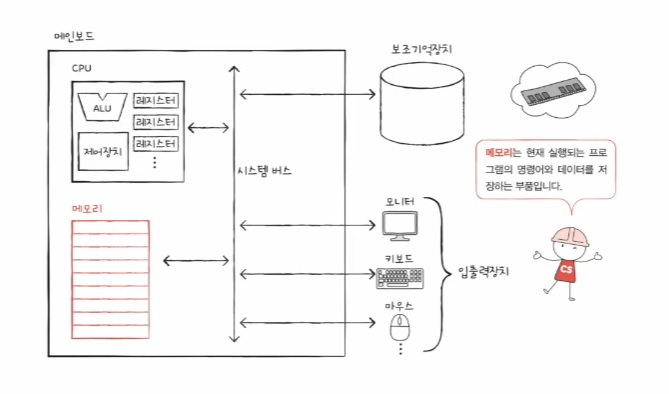
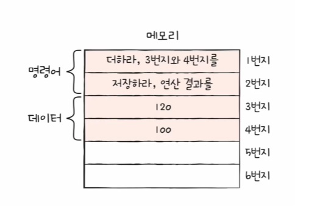
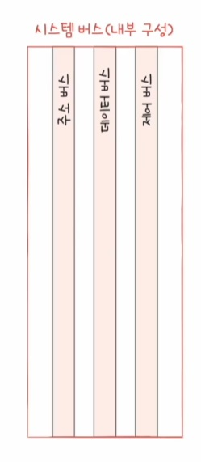

# 컴퓨터의 구조

## 목차
- [컴퓨터의 구조](#컴퓨터의-구조)
  - [목차](#목차)
  - [컴퓨터란?](#컴퓨터란)
  - [전체 구조](#전체-구조)
  - [메모리 구조](#메모리-구조)
  - [CPU 구조](#cpu-구조)
  - [보조기억장치](#보조기억장치)
  - [입출력 장치](#입출력-장치)
  - [메인보드](#메인보드)
  - [참고](#참고)

## 컴퓨터란?
명령어와 데이터를 처리하는 기계

`'안녕하세요'를 출력`
'안녕하세요' -> 데이터
를 출력 -> 명령어

## 전체 구조

- 시스템 버스 : 컴퓨터 부품들간 통신하기 위한 통로

## 메모리 구조

휘발성 저장장치로 실행할 정보를 저장합니다.

- 프로그램이 실행되기 위해서는 메모리에 저장되어있어야한다.
- 실행되는 프로그램의 명령어와 데이터를 저장한다.
- 메모리에 저장된 값의 위치는 주소로 알 수 있다.

## CPU 구조

메모리에 저장된 명령어를 읽어 들이고, 해석하고, 실행하는 부품입니다.

<b>핵심 내부 부품</b>
- ALU: 산술논리연산장치(계산기)
- 레지스터: CPU 내부에 있는 작은 저장장치
- 제어장치: 제어 신호를 내보내고, 명령어를 해석하는 장치
  - 제어신호: 컴퓨터 푸품들을 고나리하고 작동시키기 위한 전기 신호

## 보조기억장치

전원이 꺼져도 보관할 정보를 저장합니다.

## 입출력 장치

컴퓨터 외부에 연결되어 컴퓨터 내부와정보를 교환할 수 있는 부품입니다.
`모니터, 키보드, 마우스 등등`

## 메인보드
컴퓨터의 핵심 부품을 연결하여 부품들끼리 정보를 주고 받을 수 있게 하는 부품입니다.
- 메인보드에 연결된 부품은 버스를 통해 정보를 주고 받음
- 버스는 컴퓨터의 부품끼리 정보를 주고받는 일종의 통로
- 다양한 종류의 버스가 존해합니다
- 컴퓨터의 핵심 부품을 연결하는 버스는 `시스템 버스`입니다.
  - 
  - 주소 버스: 주소를 주고받는 통로
  - 데이터 버스: 명령어와 데이터를 주고받는 통로
  - 제어 버스: 제어 신호를 주고받는 통로

## 참고
[인프런_컴퓨터구조](https://www.inflearn.com/course/lecture?courseSlug=%ED%98%BC%EC%9E%90-%EA%B3%B5%EB%B6%80%ED%95%98%EB%8A%94-%EC%BB%B4%ED%93%A8%ED%84%B0%EA%B5%AC%EC%A1%B0-%EC%9A%B4%EC%98%81%EC%B2%B4%EC%A0%9C)