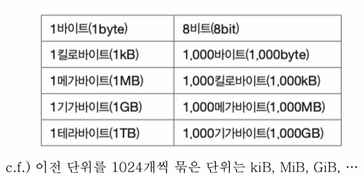
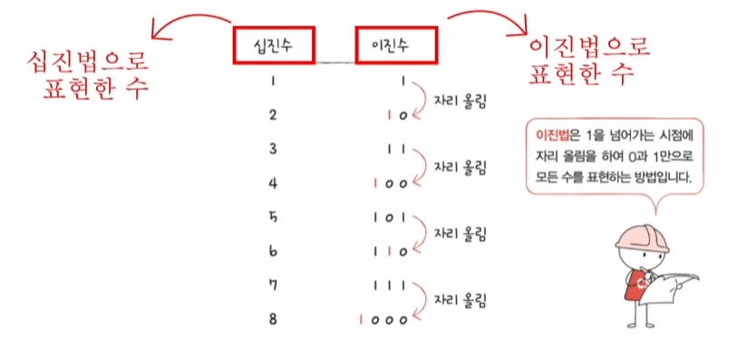
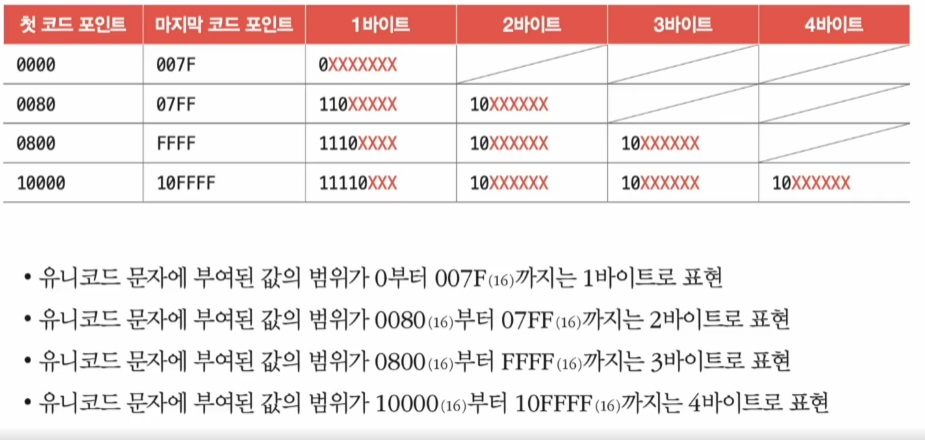

# 정보 단위

## 목차
- [정보 단위](#정보-단위)
  - [목차](#목차)
  - [비트(bit)](#비트bit)
  - [워드(word)](#워드word)
  - [숫자를 표현하는 방법](#숫자를-표현하는-방법)
    - [이진법](#이진법)
    - [십육진법](#십육진법)
  - [문자를 표현하는 방법](#문자를-표현하는-방법)
    - [문자 집합과 인코딩](#문자-집합과-인코딩)
    - [아스키 코드](#아스키-코드)
    - [한글 인코딩](#한글-인코딩)
    - [EUC-KR](#euc-kr)
    - [유니코드 문자 집합과 utf-8](#유니코드-문자-집합과-utf-8)
      - [유니코드](#유니코드)
      - [utf-8](#utf-8)
  - [참고](#참고)

## 비트(bit)
0과 1을 표현하는 가장 작은 정보 단위

- n비트로는 2**n가지의 정보 표현 가능
- 프로그램은 수많은 비트로 이루어져 있음
- 평소에는 사용하지 않는 표현
- 비트보다 더 큰 단위를 사용
  - 바이트, 킬로바이트, 메가바이트, 기가바이트, 테라바이트 등

> 최근에는 1000개와 1024개를 묶은 단위를 구분해서 사용함

## 워드(word)
- CPU가 한 번에 처리할 수 있는 정보의 크기 단위
- 하프 워드 (half word): 워드의 절반 크기
- 풀 워드 (full word): 워드 크기
- 더블 워드 (double word): 워드의 두 배 크기

## 숫자를 표현하는 방법

### 이진법
- 0과 1로 수를 표현하는 방법
- 숫자가 1을 넘어가는 시점에 자리올림
- 우리가 일상적으로 사용하는 진법은 숫자가 9를 넘어갈때 자리올림하는 십진법(decimal)

### 십육진법
- 수가 15를 넘어가는 시점에 자리올림하는 기법
- 이진법으로는 숫자의 길이가 너무 길어짐
- 데이터를 표현할 때 십육진법도 많이 사용함
- ex) 0x15

> 이진법과 십육진법을 사용하는 이유는 이진법과 변환이 간편하기 때문

## 문자를 표현하는 방법

### 문자 집합과 인코딩

- 문자 집합 (character set)
  - 컴퓨터가 이해할 수 있는 문자의 모음
- 인코딩 (encoding)
  - 코드화하는 과정
  - (문자 집합에 속한 문자를 )0과 1로 이루어진 문자 코드로 변환하는 과정
- 디코딩 (decoding)
  - 코드를 해석하는 과정
  - (문자 집합에 속한 문자를) 0과 1로 표현된 문자 코드로 문자로 변환하는 과정
  
### 아스키 코드
- 초창기 문자 집합 중 하나
- 알파벳, 아라비아 숫자, 일부 특수 문자 및 제어 문자
- 7비트로 하나의 문자 표현
  - 8비트 중 1비트는 오류 검출을 위해 사용되는 패리티 비트(parity bit)
- 2**7(128)개의 문자를 표현가능함
- 간단한 인코딩이 가능하지만 한글을 포함한 다른 언어 문자, 다양한 특수 문자 표현 불가
  - 8비트 확장 아스키 (extended ASCII)가 등장했지만 여전히 부족함
  
### 한글 인코딩

- 한글을 위한 인코딩이 필요
  - 한글의 특징
  - 영어는 알파벳을 이어쓰면 단어가 되지만 한글은 초성, 중성, 종성의 조합으로 이루어짐
  - `완성현 인코딩 방식`과 `조합형 인코딩 방식`이 존재
  
### EUC-KR
  - KS X 1001 KS X 1003 문자집합 기반의 한글 인코딩 방식
  - 완성형 인코딩
  - 글자 하나 하나에 2바이트 크기의 코드 부여
    - 2바이트 == 16 비트 == 4자리의 16진수
  - 2300여개의 한글 표현 가능
  - 여전히 모든 한글을 표현하기에는 부족한 수
  - 쀏,뙠,휔 같은 한글은 표현 불가능
  - [인코딩_온라인사이트](https://dencode.com)
  
### 유니코드 문자 집합과 utf-8

#### 유니코드

    - 통일된 문자 집합
    - 한글, 영어, 화살표와 같은 특수 문자, 심지어 이모티콘까지
    - 현대 문자 표현에 있어 매우 중요한 위치

유니코드의 인코딩 방식 
- utf-8, utf-16, utf-32...
- [유니코드_온라인사이트](https://symbl.cc/en/unicode/blocks/)

#### utf-8
- UTF (Unicode Transformation Format): 유니코드 인코딩 방법
- 가변 길이 인코딩: 인코딩 결과가 1바이트 ~ 4바이트
- 인코딩 결과가 몇 바이트가 될지는 유니코드에 부여된 값에 따라 다름
  - 유니코드에 부여된 값 == 유니코드 코드 포인트

[인코딩_체험사이트](https://onlineutf8tools.com/convert-utf8-to-binary)

## 참고
[인프런_컴퓨터구조](https://www.inflearn.com/course/lecture?courseSlug=%ED%98%BC%EC%9E%90-%EA%B3%B5%EB%B6%80%ED%95%98%EB%8A%94-%EC%BB%B4%ED%93%A8%ED%84%B0%EA%B5%AC%EC%A1%B0-%EC%9A%B4%EC%98%81%EC%B2%B4%EC%A0%9C)