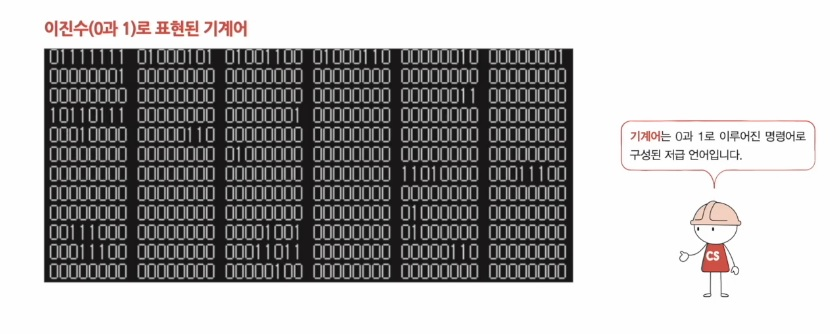
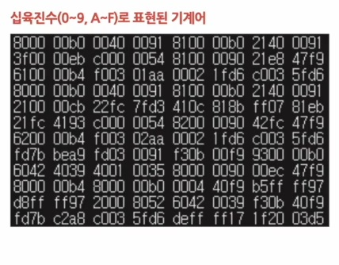
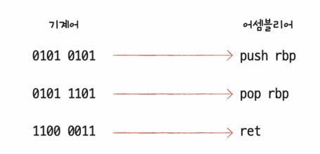
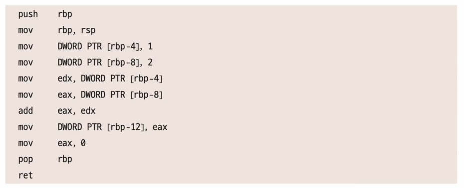
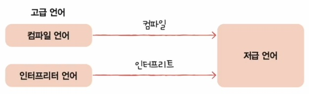

# 소스 코드와 명령어

## 언어 종류
- 고급언어
  - 개발자가 이해하기 쉽게 만든 언어
- 저급 언어
  - 컴퓨터가 이해하고 실행하는 언어

## 저급 언어

### 기계어

    

        
    

    

        
    

### 어셈블리어

    

        
    

    

        
    

## 고급 언어

### 컴파일 언어

컴파일 언어로 작성된 소스 코드는 컴파일러에 의해 저급 언어로 변환되고(`컴파일`), 컴파일 결과로 저급 언어인 `목적 코드`가 생성됩니다.
- 소스코드 전체를 확인

### 인터프리트 언어

- 인터프리터에 의해 한줄씩 실행
- 소스 코드 전체가 저급 언어로 변환되기까지 기다릴 필요없음

### 실행 방식

### 참고할만한 사이트
[컴파일&인터프리터 과정 살펴보기](https://godbolt.org/)

| CPU와 컴파일 종류에 따라 저급언어의 모습이 바뀜

