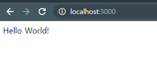

# node.js / express install

## 개요

### node.js란? 

Node.js는 확장성 있는 네트워크 애플리케이션(특히 서버 사이드) 개발에 사용되는 소프트웨어 플랫폼이다. 작성 언어로 자바스크립트를 활용하며 Non-blocking I/O와 단일 스레드 이벤트 루프를 통한 높은 처리 성능을 가지고 있다.

내장 HTTP 서버 라이브러리를 포함하고 있어 웹 서버에서 아파치 등의 별도의 소프트웨어 없이 동작하는 것이 가능하며 이를 통해 웹 서버의 동작에 있어 더 많은 통제를 가능케 한다.

> [위키백과참조](https://ko.wikipedia.org/wiki/Node.js)

### express란?

Express.js, 또는 간단히 익스프레스(Express)는 Node.js를 위한 웹 프레임워크의 하나로, MIT 허가서로 라이선스되는 자유-오픈 소스 소프트웨어로 출시되었다. 웹 애플리케이션, API 개발을 위해 설계되었다. Node.js의 사실상의 표준 서버 프레임워크로 불리고 있다.

원 제작자 TJ Holowaychuk는 이 소프트웨어를 시나트라에 영향을 받은 서버로 기술하고 있으며 이는 플러그인으로 이용 가능한 수많은 기능들을 갖추면서 크기는 상대적으로 최소한임을 의미한다. 익스프레스는 몽고DB 데이터베이스 소프트웨어, AngularJS 프론트엔드 프레임워크와 함께 MEAN 스택의 백엔드 구성 요소이다.

> [위키백과참조](https://ko.wikipedia.org/wiki/Express.js)


## 설치

[node.js](https://nodejs.org/ko/)에 접속 후 LTS버전으로 설치를 진행합니다.

cmd에 `node.js -v`명령어로 node설치를 확인합니다.

## 프로젝트 세팅

디렉토리 생성 후 `npm init`으로 npm 초기세팅을 진행합니다.

```
This utility will walk you through creating a package.json file.
It only covers the most common items, and tries to guess sensible defaults.

See `npm help json` for definitive documentation on these fields
and exactly what they do.

Use `npm install <pkg>` afterwards to install a package and
save it as a dependency in the package.json file.

Press ^C at any time to quit.
package name: (boiler-plate)
version: (1.0.0)
description: node study
entry point: (index.js)
test command:
git repository:
keywords:
author: min
license: (ISC)
About to write to G:\node\boiler-plate\package.json:

{
  "name": "boiler-plate",
  "version": "1.0.0",
  "description": "node study",
  "main": "index.js",
  "scripts": {
    "test": "echo \"Error: no test specified\" && exit 1"
  },
  "author": "min",
  "license": "ISC"
}


Is this OK? (yes)


   ╭────────────────────────────────────────────────────────────────╮
   │                                                                │
   │      New minor version of npm available! 6.13.4 -> 6.14.8      │
   │   Changelog: https://github.com/npm/cli/releases/tag/v6.14.8   │
   │               Run npm install -g npm to update!                │
   │                                                                │
   ╰────────────────────────────────────────────────────────────────╯
```

필요한 정보는 입력하고 만약 기본값으로 진행하는 경우 `enter`를 입력하면됩니다.

비어있는 `index.js` 파일을 생성합니다.

cmd에 `npm install express --save`로 express를 설치합니다.

```
$ npm install express --save
npm notice created a lockfile as package-lock.json. You should commit this file.
npm WARN boiler-plate@1.0.0 No repository field.

+ express@4.17.1
added 50 packages from 37 contributors and audited 50 packages in 1.622s
found 0 vulnerabilities
```

`--save`옵션을 주었기 때문에 `packge.json`에 express가 추가된 모습을 확인할 수 있습니다.

```json
{
  "name": "boiler-plate",
  "version": "1.0.0",
  "description": "node study",
  "main": "index.js",
  "scripts": {
    "test": "echo \"Error: no test specified\" && exit 1"
  },
  "author": "min",
  "license": "ISC",
  "dependencies": {
    "express": "^4.17.1"
  }
}
```

설치가 성공적으로 되었다면 node_moudules이라는 폴더가 생성되었고 폴더안에 많은 파일들이 있습니다. 이 폴더들은 express가 설치될때 의존성이 있는 패키지들도 같이 설치된 것입니다.

앞으로 모르는 것이 있다면 [express_document](https://expressjs.com/ko)을 가장 많이 이용해야됩니다.

[예제](https://expressjs.com/ko/starter/hello-world.html)를 진행하겠습니다.

```javascript
//1
const express = require('express')
const app = express()
const port = 3000

//2
app.get('/', (req, res) => {
  res.send('Hello World!')
})

//3
app.listen(port, () => {
  console.log(`Example app listening at http://localhost:${port}`)
})
```

1. require function으로 express를 가져오고 다시 express function을 이용하여 app을 생성합니다.port는 3000입니다.

2. route가 get방식으로 `/`로 접속 시 `Hello World!`를 출력하겠다는 뜻입니다.

3. 설정한 port로 app을 실행하겠다는 뜻입니다.


`packge.json`의 `script`에 추가합니다.

```json
"scripts": {
    "start": "node index.js",
    "test": "echo \"Error: no test specified\" && exit 1"
},
```

node : node를 실행한다는 명령어

index.js : 실행할 파일

node로 index.js를 실행하겠다는 뜻입니다.

cmd에 `npm run start`을 입력합니다.

```
$ npm run start

> boiler-plate@1.0.0 start G:\node\boiler-plate
> node index.js

Example app listening at http://localhost:3000
```




## 참고

[노드리액트기초강의-JohnAhn-인프런](https://www.inflearn.com/course/%EB%94%B0%EB%9D%BC%ED%95%98%EB%A9%B0-%EB%B0%B0%EC%9A%B0%EB%8A%94-%EB%85%B8%EB%93%9C-%EB%A6%AC%EC%95%A1%ED%8A%B8-%EA%B8%B0%EB%B3%B8/lecture/37064?tab=question&q=42176)

[express_document](https://expressjs.com/ko)