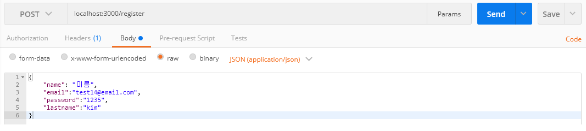
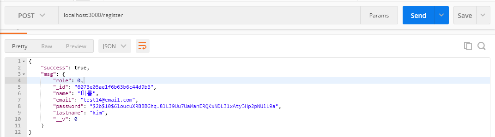
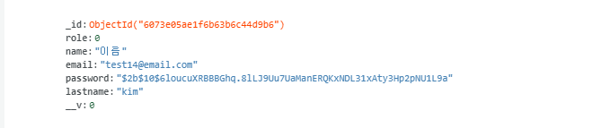

# Bcrypt 비밀번호 암호화 하기

## 개요

비밀번호는 민감한 개인 정보이기 때문에 DB에 저장될 때도 어떤 내용으로 들어가는지 몰라야합니다. 따라서 저장을 진행할 때 bcrypt library를 이용하여 암호화를 진행한 후 저장합니다.

## bcrypt library install

명령어 입력

```shell
npm install bcrypt --save
```

결과

```shell

> bcrypt@5.0.1 install G:\node\boiler-plate\node_modules\bcrypt
> node-pre-gyp install --fallback-to-build

[bcrypt] Success: "G:\node\boiler-plate\node_modules\bcrypt\lib\binding\napi-v3\bcrypt_lib.node" is installed via remote
npm WARN boiler-plate@1.0.0 No repository field.
npm WARN optional SKIPPING OPTIONAL DEPENDENCY: fsevents@2.1.3 (node_modules\fsevents):
npm WARN notsup SKIPPING OPTIONAL DEPENDENCY: Unsupported platform for fsevents@2.1.3: wanted {"os":"darwin","arch":"any"} (current: {"os":"win32","arch":"x64"})

+ bcrypt@5.0.1
added 45 packages from 106 contributors and audited 241 packages in 5.868s

13 packages are looking for funding
  run `npm fund` for details

found 4 vulnerabilities (3 low, 1 moderate)
  run `npm audit fix` to fix them, or `npm audit` for details


   ╭───────────────────────────────────────────────────────────────╮
   │                                                               │
   │      New major version of npm available! 6.13.4 -> 7.9.0      │
   │   Changelog: https://github.com/npm/cli/releases/tag/v7.9.0   │
   │               Run npm install -g npm to update!               │
   │                                                               │
   ╰───────────────────────────────────────────────────────────────╯
```

## 적용

user.js

```js
~
const bcrypt = require('bcrypt');
const saltRounds = 10;
~

// save함수를 실행하기 전에 해당 함수를 먼저 실행합니다.
userSchema.pre('save', function(next) {
    let user = this;

    if ( ! user.isModified('password')) return next();

    // 비밀번호를 암호화 시킴
    bcrypt.genSalt(saltRounds, function(err, salt) {
        if (err) return next(err);

        bcrypt.hash(user.password, salt, function(err, hash) {
            if (err) return next(err);

            user.password = hash;
            next();// 다음 함수로 진행 여기서는 save 함수

        })

    });

}); //MongDB에서 제공해주는 Method
```

> [Bcrypt 사용법](https://www.npmjs.com/package/bcrypt)

서버 실행 후 postman으로 확인

postman 전송



postman 결과



DB 결과



## 참고

[인프런-노트-리액트-강의](https://www.inflearn.com/course/%EB%94%B0%EB%9D%BC%ED%95%98%EB%A9%B0-%EB%B0%B0%EC%9A%B0%EB%8A%94-%EB%85%B8%EB%93%9C-%EB%A6%AC%EC%95%A1%ED%8A%B8-%EA%B8%B0%EB%B3%B8/lecture/37072?tab=note)
