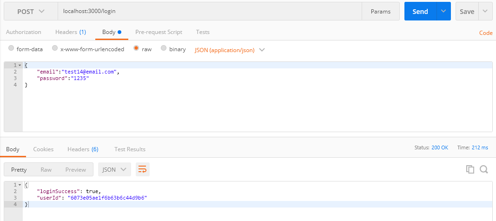

# 로그인 기능

## router 생성

로그인 후 비밀번호 검증과 토큰을 생성한 다음 쿠키에 저장하깅 위해 `cookie-parser`와 `jsonwebtoken`을 설치합니다.

`npm install jsonwebtoken --save` 입력

```shell
npm install jsonwebtoken --save
npm WARN boiler-plate@1.0.0 No repository field.
npm WARN optional SKIPPING OPTIONAL DEPENDENCY: fsevents@2.1.3 (node_modules\fsevents):
npm WARN notsup SKIPPING OPTIONAL DEPENDENCY: Unsupported platform for fsevents@2.1.3: wanted {"os":"darwin","arch":"any"} (current: {"os":"win32","arch":"x64"})

+ jsonwebtoken@8.5.1
added 13 packages from 9 contributors and audited 254 packages in 2.127s

13 packages are looking for funding
  run `npm fund` for details       

found 4 vulnerabilities (3 low, 1 moderate)
  run `npm audit fix` to fix them, or `npm audit` for details
```

> 사용법 [jsonwebtoken-npm](https://www.npmjs.com/package/jsonwebtoken)

`npm install cookie-parser --save` 입력

```shell
$ npm install cookie-parser --save
npm WARN boiler-plate@1.0.0 No repository field.
npm WARN optional SKIPPING OPTIONAL DEPENDENCY: fsevents@2.1.3 (node_modules\fsevents):
npm WARN notsup SKIPPING OPTIONAL DEPENDENCY: Unsupported platform for fsevents@2.1.3: wanted {"os":"darwin","arch":"any"} (current: {"os":"win32","arch":"x64"})

+ cookie-parser@1.4.5
added 1 package from 2 contributors and audited 255 packages in 1.993s

13 packages are looking for funding
  run `npm fund` for details

found 4 vulnerabilities (3 low, 1 moderate)
  run `npm audit fix` to fix them, or `npm audit` for details
```

jsonwebtoken을 rquire 후 비밀번호 확인, 토큰 생성 함수를 작성합니다.

user.js

```js
~
const jwt = require('jsonwebtoken');
~
// 비밀번호 확인
userSchema.methods.comparePassword = function (inputPassword, cb) {

    let user = this;

    bcrypt.compare(inputPassword, user.password, (err, isMatch) => {
        if(err) return cb(err);

        cb(null, isMatch);
    });
}

// 토큰 생성
userSchema.methods.generateToken = function(cb) {

    let user = this;

    // jsonwebtoken 사용
    user.token =  jwt.sign(user._id.toHexString(), 'secretToekn');
    user.save(function(err, user) {
        if (err) return cb(err);

        cb(null, user);
    })
    
}
```

그 후 router를 추가합니다.

index.js

```js
~
const cookieParser = require('cookie-parser');
~
app.use(cookieParser());
~
app.post('/login', (req, res) => {
	// 로그인

	// 요청된 이메일을 DB에서 찾음
	User.findOne({ email: req.body.email }, (err, user) => {
		if ( ! user) {
			return res.json({loginSuccess: false, message: "해당 이메일이 없습니다."})
		}

		// 요청된 이메일이 DB에 있다면 비밀번호 확인
		user.comparePassword(req.body.password, (err, isMatch) => {
			if ( ! isMatch) return res.json({loginSuccess: false, message: "비빌번호가 다릅니다."})
		});
		
		// 토큰 생성
		user.generateToken((err, user) => {
			if (err) return res.status(400).send(err);

			// 토큰 저장
			res.cookie("x_auth", user.token)
			.status(200).json({ loginSuccess: true, userId: user._id});
			
		})
	});
	
})
```

## 결과



## 참고
[따라하며-배우는-노드-리액트-기본](https://www.inflearn.com/course/%EB%94%B0%EB%9D%BC%ED%95%98%EB%A9%B0-%EB%B0%B0%EC%9A%B0%EB%8A%94-%EB%85%B8%EB%93%9C-%EB%A6%AC%EC%95%A1%ED%8A%B8-%EA%B8%B0%EB%B3%B8/lecture/37073?tab=note)
