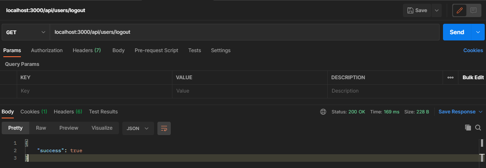
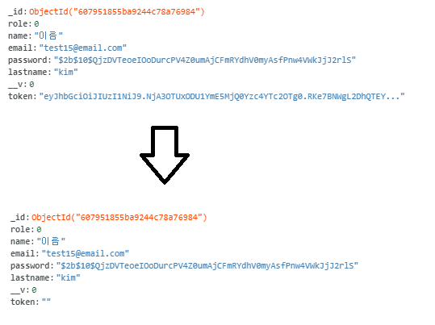

# Auth, Logout 기능

## Auth 개요

로그인이 필요한 기능을 사용할 때 사용하는 인증 기능입니다.

DB의 토큰과 local에 저장(localstorage, cookie)한 토큰을 비교합니다.

## middleware 작성

### middleware란?

미들웨어(영어: middleware)는 컴퓨터 제작 회사가 사용자의 요구대로 만들어 제공하는 프로그램으로, 운영 체제와 응용 소프트웨어의 중간에서 조정과 중개의 역할을 수행하는 소프트웨어이다. 응용 소프트웨어가 운영 체제로부터 제공받는 서비스 이외에 추가적으로 이용할 수 있는 서비스를 제공하는 컴퓨터 소프트웨어이다. "소프트웨어 글루"(software glue)로 이야기된다. 응용 소프트웨어는 유연하고 확장, 축소가 편리하여야 하며 이러한 장점을 충족하기에 개발자의 다른 기종 간 플랫폼을 다시 구축할 필요가 없어야 한다. 이를테면 데이터베이스 시스템, 전자 통신 소프트웨어, 메시지 및 쿼리 처리 소프트웨어를 들 수 있다.

> [위키백과](https://ko.wikipedia.org/wiki/%EB%AF%B8%EB%93%A4%EC%9B%A8%EC%96%B4)

/middleware/auth.js

```js
const { User } = require('../Models/User');

let auth = (req, res, next) => {
    //인증처리
    
    // cookie
    let token = req.cookies.x_auth;

    // 토큰복호화 후 유저 검색
    User.findByToken(token, (err, user) => {

        if (err) throw err;
        if ( ! user) return res.json({ isAuth: false, error: true});

        req.token = token;
        req.user = user;
        next();
    });
    
    // 유저 있다면 인증
}

module.exports = { auth };
```

User model에 findByToken 함수 추가

```js
userSchema.statics.findByToken = function(token, cb) {
    let user = this;

    //토큰 decode
    jwt.verify(token, 'secretToken', function(err, decoded) {
        // 유저 아이디를이용하여 유저 검색 후
        // 클라이언트에서 가져온 token과 db에 보관된 토큰이 일치하는지 확인
        user.findOne({'_id' : decoded, 'token' : token}, function (err, user) {
            if (err) return cb(err);

            cb(null, user);
        });

    });
}
```

router 작성

index.js

```js
app.get('/api/users/auth', auth, (req, res) => {
	res.status(200).json({ user: req.user })
})

app.get('/api/users/logout', auth, (req, res) => {
	User.findOneAndUpdate(
		{ _id: req.user._id }, 
		{ token: "" }, 
		(err, user) => {
			if (err) return res.json({ success: false, err });
			return res.status(200).send({ success: true });
		}
	)
})
```

## 결과





