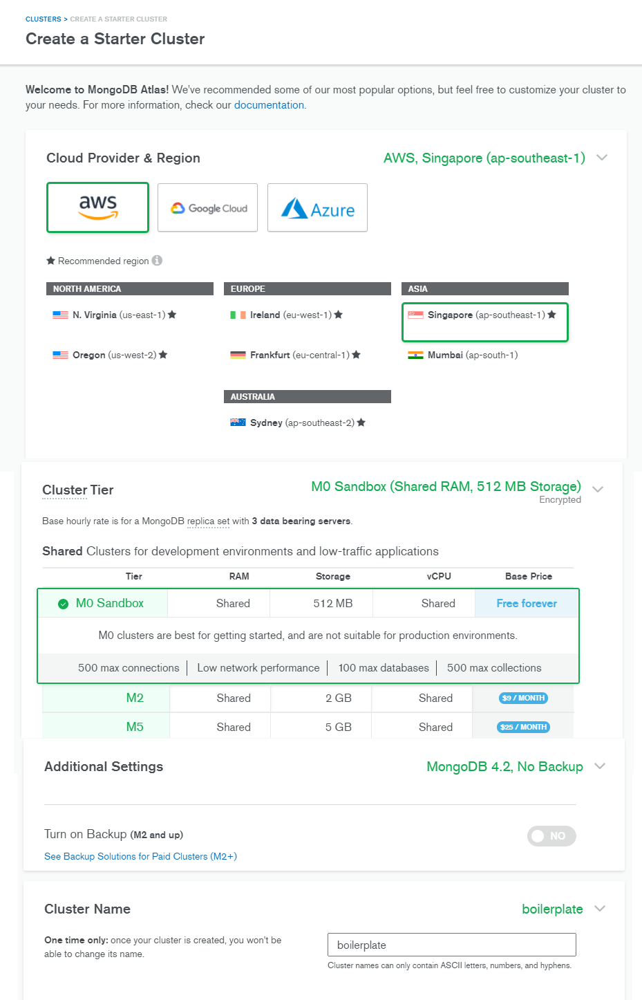
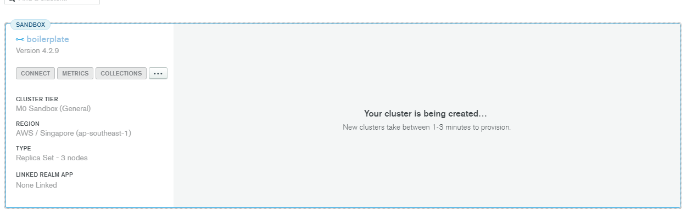
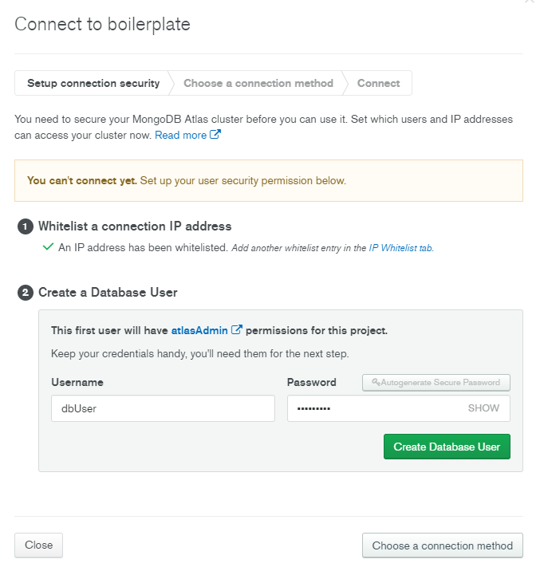
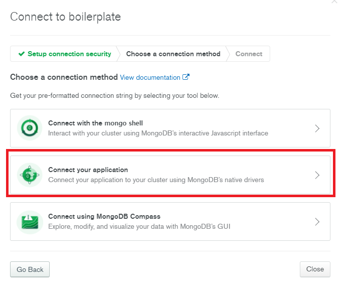
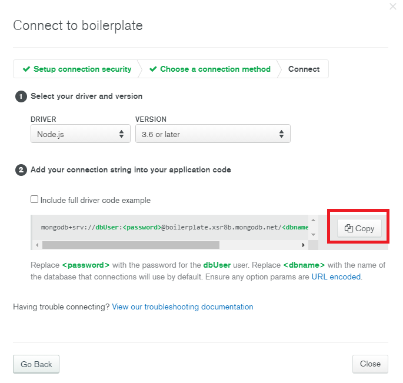

# 몽고 DB 연결

## 설치

### 몽고 DB란?
몽고DB는 크로스 플랫폼 도큐먼트 지향 데이터베이스 시스템이다. NoSQL 데이터베이스로 분류되는 몽고DB는 JSON과 같은 동적 스키마형 도큐먼트들을 선호함에 따라 전통적인 테이블 기반 관계형 데이터베이스 구조의 사용을 삼간다.

> [위키백과](https://www.google.com/search?q=%EB%AA%BD%EA%B3%A0DB&oq=%EB%AA%BD%EA%B3%A0DB&aqs=chrome..69i57j0l7.2418j0j7&sourceid=chrome&ie=UTF-8)

[설치링크](https://www.mongodb.com/)

접속 후 아이디가 없다면 회원가입을 진행합니다.



클라우드에 몽고 DB를 생성합니다

region은 현재 우리나라와 가장 가까운곳을 선택하는 것이 좋습니다.(Singapore)

Cluster Name은 자유롭게 설정하시면됩니다.

모두 설정했으면 하단에 있는 `Cluster Create`버튼을 누르시면됩니다.

생성 시간은 1~3분정도 소요됩니다.



### 유저 생성

생성이 완료가 되었다면 `CONNECT` 버튼을 클릭합니다.



현재 사용하시는 컴퓨터의 IP를 whitelist에 등록합니다.

username과 password를 입력하고 `Create Database User`를 클릭하여 유저를 생성합니다.






`Copy` 버튼을 클릭하여 복사해서 잠시 저장해주세요.

### Mongoose 다운로드

`npm install mongoose --save` 커맨드로 다운로드해주세요.

```
$ npm install mongoose --save
npm WARN boiler-plate@1.0.0 No repository field.

+ mongoose@5.10.5
added 5 packages from 3 contributors and audited 78 packages in 1.669s

1 package is looking for funding
  run `npm fund` for details

found 0 vulnerabilities
```


## DB connect

전에 만들어놓은 어플리케이션 `index.js`에 추가하겠습니다.

```javascript
const express = require('express')
const app = express()
const port = 3000

//DB Connect
const mongoose = require("mongoose")
mongoose.connect('mongodb+srv://dbUser:<password>@boilerplate.xsr8b.mongodb.net/<dbname>?retryWrites=true&w=majority',{
  useNewUrlParser: true, useUnifiedTopology: true, useCreateIndex: true, useFindAndModify: false
}).then(() => console.log("Mongo DB Connected..."))
  .catch(err => console.log(err))

app.get('/', (req, res) => {
  res.send('Hello World!')
})

app.listen(port, () => {
  console.log(`Example app listening at http://localhost:${port}`)
})
```

`<password>`부분을 유저를 만들때 입력한 비밀번호로 바꿔주세요.

1. useNewUrlParser : deprecatedError 에러가 발생되며 조만간 없어진다는 경고 메세지가 출력되는것을 방지합니다.
2. useUnifiedTopology : 1과 마찬가지로 버전에 관련된 경고입니다.
3. useCreateIndex : 기본적으로 Mongoose는 MongoDB의 ensureIndex()함수를 호출하는데 Mongoose의 기능을 정상적으로 이용하려면 추가합니다.

    3-1. 원문 : By default, Mongoose 5.x calls the MongoDB driver's ensureIndex() function. The MongoDB driver deprecated this function in favor of createIndex(). Set the useCreateIndex global option to opt in to making Mongoose use createIndex() instead.
    > 출처 :  https://mongoosejs.com/docs/deprecations.html
4. MongoDB 드라이버의 기본 함수는 느리기 때문에 findAndModify()대신 findOneAndUpdate()기능을 사용한다고합니다.

    4-1. 원문 : Mongoose's findOneAndUpdate() long pre-dates the MongoDB driver's findOneAndUpdate() function, so it uses the MongoDB driver's findAndModify() function instead. You can opt in to using the MongoDB driver's findOneAndUpdate() function using the useFindAndModify global option.
    > 출처 : https://mongoosejs.com/docs/deprecations.html

## 실행

```shell
$ npm run start

> boiler-plate@1.0.0 start G:\node\boiler-plate
> node index.js

Example app listening at http://localhost:3000
Mongo DB Connected...
```

정상적으로 실행된 모습을 확인할 수 있습니다.

## 참고

[따라하며-배우는-노드-리액트-기본](https://www.inflearn.com/course/%EB%94%B0%EB%9D%BC%ED%95%98%EB%A9%B0-%EB%B0%B0%EC%9A%B0%EB%8A%94-%EB%85%B8%EB%93%9C-%EB%A6%AC%EC%95%A1%ED%8A%B8-%EA%B8%B0%EB%B3%B8/lecture/37065?tab=note)

[위키백과-MongDB](https://www.google.com/search?q=%EB%AA%BD%EA%B3%A0DB&oq=%EB%AA%BD%EA%B3%A0DB&aqs=chrome..69i57j0l7.2418j0j7&sourceid=chrome&ie=UTF-8)

[Mongoose-connect-option](https://mongoosejs.com/docs/deprecations.html)


