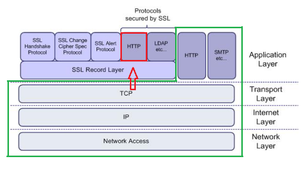

# http와 https

HTTP  : Hypertext Transfer Protocol

HTTPS : Hypertext Transfer Protocol Secure(Over Secure Socket Layer)

Hypertext
 - 문서와 문서가 링크로 연결되어있는 체계 또는 구조
 - HTML을 전송하기 위한 통신 규약

HTTP와 HTTPS는 HTML을 전송하기 위한 방식이며 두 개의 차이는 보안의 차이가 있습니다.

HTTP보다 HTTPS는 보안 장치가 더욱 많이 결합되어있습니다.
> 여기서의 보안은 데이터의 위조, 변조 및 가로채는 것을 방지하는 것을 뜻합니다.

적용 대상으로는 로그인, 개인정보 입력, 제 3자가 봐서는 안되는 데이터를 취급하는 페이지에서 사용합니다.

# HTTPS와 SSL
SSL 인증서를 적용시키면 HTTPS를 이용가능합니다. 이로인해 SSL과 HTTPS가 같다고 생각이 될 수 있지만 사실 서로 다른 계층에 있습니다.

위와 같이 SSL 계층이 있고 그위에서 HTTPS가 돌아가는 구조입니다.

그림만 봐도 HTTP는 바로 TCP로 넘어가지만 HTTPS는 SSL이라는 계층을 한 번 더 거쳐서 TCP로 들어갑니다.

# SSL와 TLS

네스케이프가 SSL을 발명 후 사용되다 IETF(표준화 기구)의 관리로 변경되면서 TLS라는 이름으로 변경되었습니다.
> TLS 1.0은 SSL 3.0을 계승합니다.

# SSL

SSL 인증서의 목적은 사용자가 접속한 서버가 신뢰 할 수 있는 서버임을 보장합니다.

동작 메커니즘이 매우 복잡하며 다양한 기술이 집약되어있습니다.

SSL 통신에 사용할 공개키를 사용자에게 제공합니다.

## CA
사용자가 접속한 서버가 의도한 서버가 맞는지를 보장,보증하는 역할을 합니다.
이러한 역할을 하는 민간기업이 있는데 CA(Certificate authority), Root Certificate라고 합니다. 

대표적으로 MicroSoft의 edge, Google의 Chrome, apple의 Safari, Mozilla의 Firefox가 심사를 거쳐 자사의 브라우저에 탑재한 것입니다.

## SSL 인증서의 내용
 - 서비스 정보
   - 인증서를 발급한 CA, 서버의 도메인
 - 서버의 공개키
   - 공개키 내용, 공개키 암호화 방법

이미지 출처 및 참고 링크

https://medium.com/@shaul1991/%EC%B4%88%EB%B3%B4%EA%B0%9C%EB%B0%9C%EC%9E%90-%EC%9D%BC%EC%A7%80-http-%ED%94%84%EB%A1%9C%ED%86%A0%EC%BD%9C%EC%9D%98-%EC%9D%B4%ED%95%B4-3-https-ssl-%EC%9D%B8%EC%A6%9D%EC%84%9C-ad677cf5492a

https://victorydntmd.tistory.com/95

https://ko.wikipedia.org/wiki/HTTPS
