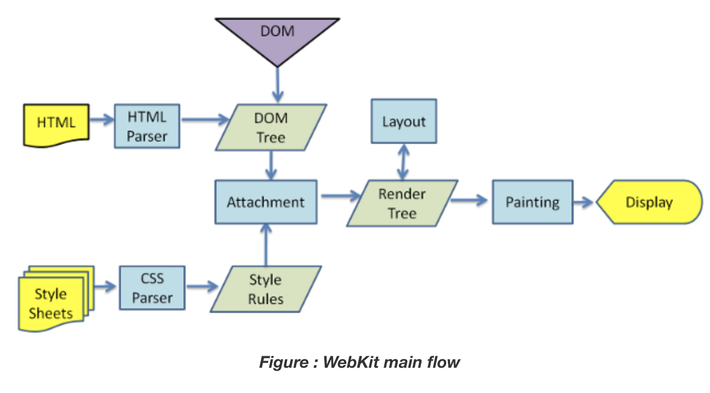

# React란?

## 특징

1. React는 Library로 Facebook에서 2013년에 제작하였습니다.
2. Components로 이루어져 있어 재사용이 뛰어납니다.
3. Virtual Dom

### Real DOM vs Virtual DOM

브라우저의 렌더링 과정은 HTML을 파싱하여 DOM 객체를 생성 후 css 파싱하여 스타일 규칙을 만듭니다. 이런 과정을 표현한 것이 렌더 트리라고 하며 이 렌더 트리를 기준으로 레이아웃을 배치하고 css를 입히는 작업을 진행합니다.  

HTML을 호출할 때마다 해당 트리를 전부 다시 불러오는 것이 real dom이고 저 렌더 트리 중 변경된 것만 불러오는 방식이 virtual dom 입니다. 

### 원리
1. Virtual DOM에서 Snapshot 생성
2. 이전 버전 Snapshot과 비교하여 바뀐 부분을 search (diffing 과정)
3. Real DOM에서 변경
